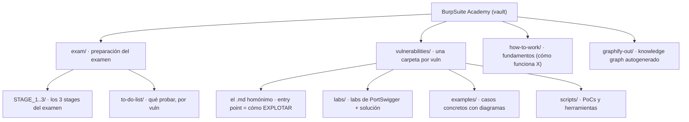

# BurpSuite Academy — mapa del proyecto

> Notas de estudio para el **BSCP** (Burp Suite Certified Practitioner). Es un **vault de Obsidian**: los enlaces son wikilinks `[[...]]` y la raíz del vault = la raíz del repo.

## 🗺️ Estructura



## 📂 Qué hay en cada lado

### `exam/` — para el día del examen (acoplado al target)
- **`STAGE_1..3/`** — los 3 stages del BSCP: **1** foothold (entrar a la cuenta víctima), **2** escalar a **admin**, **3** leer el secreto. Cada stage plantea las vulns con distinto ángulo.
- **`to-do-list/<vuln>.md`** — checklist de *qué probar* para cada vuln: flags de "¿está?" y qué hacer por stage.

### `vulnerabilities/NNN-<vuln>/` — el "cómo" (agnóstico al negocio)
Una carpeta por vulnerabilidad (30 + `open-redirect`). Dentro, según haga falta:
- **`<vuln>.md`** (a veces `README.md`) — **entry point**: metodología y **cómo explotar** la vuln ya localizada.
- **`labs/README.md`** — tabla de los **labs de PortSwigger** con objetivo, técnica y solución paso a paso.
- **`examples/NNN-*.md`** — **casos concretos**, muchos con **diagramas de secuencia** (mermaid).
- **`scripts/`** — scripts y PoCs (ej. `crack_jwt.py`, hashcat, exploits).

### `how-to-work/<tema>.md` — fundamentos conceptuales
*Cómo funciona* la tecnología, sin explotación (ej. `jwt`, `xml`, `symmetric-vs-asymmetric`). Los entry points **linkean acá** en vez de repetir la teoría.

### `graphify-out/` — grafo de conocimiento
Salida de **graphify** (autogenerada, gitignored): se reconstruye en cada commit para consultar el vault como grafo.

## 🔗 Cómo se relacionan (flujo de uso)

```
to-do-list/<vuln>  ó  STAGE_x   →   entry point (cómo explotar)
                                     ├─ ¿me falta base? → how-to-work/<tema>
                                     └─ practicar       → labs/  ·  examples/
```

- **Buscar** la vuln → `exam/` (STAGE + to-do-list, con pistas del target).
- **Explotarla** → `vulnerabilities/<vuln>/` entry point.
- **Entenderla desde cero** → `how-to-work/`.
- **Ver casos y diagramas** → `labs/` y `examples/`.

> **Regla de oro (separación de capas):** `exam/` = *dónde/negocio* · `vulnerabilities/` = *cómo/explotación* · `how-to-work/` = *qué es/teoría*. No se duplican: se enlazan.
