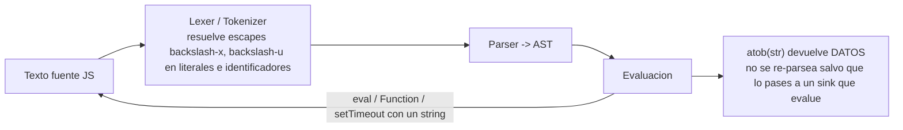

# Cómo evalúa JS una expresión y en qué ORDEN se decodifican los encodings

Pregunta clave: *"si envío hexadecimal, URL encoding, entidades HTML... ¿en qué
orden se aplican?"*

Respuesta corta: **no hay un único decoder. Hay VARIAS capas, y cada una
decodifica UNA vez.** El orden es **de fuera hacia dentro**: primero la capa por
la que "entra" tu payload (URL), luego el parser HTML, luego el motor JS, y por
último lo que decodifiques tú mismo en tiempo de ejecución (`atob`, `eval`).

Cada encoding lo entiende **solo una capa concreta**. JS por sí mismo **no**
entiende `%28` ni `&#x28;`: esos solo se decodifican si tu input pasó por la capa
URL o por el parser HTML.

---

## 1. Las capas de decodificación (el "onion")

```mermaid
flowchart TD
    P["Tu payload en la request"] --> Q{Donde se refleja el input}

    Q -->|"URL / parametro / javascript:"| U
    Q -->|"HTML: texto o atributo"| H
    Q -->|"Ya dentro de un string JS"| J

    U["Capa 1 - URL<br/>decodifica porciento-XX  (%28 pasa a parentesis)"] --> H
    H["Capa 2 - Parser HTML<br/>decodifica entidades  (&#x28; nombradas pasan a caracter)"] --> J
    J["Capa 3 - Lexer JS<br/>decodifica escapes backslash-x / backslash-u (solo en strings)"] --> R
    R["Capa 4 - Runtime<br/>atob() / eval() decodifican en ejecucion"] --> X["Codigo ejecutado"]
```



**Lectura:** una porción de payload va bajando por las capas que le
correspondan según dónde caiga. Cada flecha = **una** decodificación. Si tu
input cae directo en un string JS (no pasó por URL ni HTML), solo se le aplica la
Capa 3 en adelante.

---

## 2. Cómo evalúa el motor JS una expresión (dentro de la Capa 3)

Una vez que el texto llega al motor JS, este lo procesa así:



Puntos importantes:

- Los escapes `\xNN`, `\uNNNN`, `\u{...}` se resuelven en el **lexer**, y **solo
  dentro de literales de string/template** (y `\uNNNN` también en **nombres de
  identificador**). Fuera de un string no significan nada.
  - `alert(1)` **===** `alert(1)`  (escape unicode en el identificador).
  - `'\x61lert'` es el string `"alert"`.
- `eval(str)` / `Function(str)` / `setTimeout(str)` **re-alimentan** el string al
  principio del pipeline JS (vuelve a lexer -> parser -> eval). Por eso son
  "sinks": lo que metas ahí se vuelve a tratar como código.
- `atob(b64)` **solo devuelve datos** (el string decodificado). No ejecuta nada
  por sí mismo; hay que pasar su resultado a un sink que evalúe.

---

## 3. Qué capa entiende qué encoding

| Encoding | `(` se escribe... | ¿Quién lo decodifica? | ¿JS lo entiende solo? |
|----------|-------------------|-----------------------|-----------------------|
| URL | `%28` | Capa 1 (URL) | ❌ No |
| Entidad HTML decimal | `&#40;` | Capa 2 (parser HTML) | ❌ No |
| Entidad HTML hex | `&#x28;` | Capa 2 (parser HTML) | ❌ No |
| Entidad HTML nombrada | `&lpar;` | Capa 2 (parser HTML) | ❌ No |
| Escape hex JS | `\x28` | Capa 3 (lexer JS, en string) | ✔️ Sí |
| Escape unicode JS | `(` | Capa 3 (lexer JS, string **e** identificador) | ✔️ Sí |
| Unicode ES6 | `\u{28}` | Capa 3 (lexer JS, en string) | ✔️ Sí |
| Base64 | `atob('KA==')` | Capa 4 (runtime) | ⏳ En ejecución |

---

## 4. Reglas que se derivan del orden

1. **Cada capa decodifica UNA sola vez.** Por eso el *doble URL-encoding*
   (`%2528` -> `%28` -> `(`) sirve para atravesar un proxy/WAF que decodifica una
   vez y llegar "codificado" al backend, que decodifica la segunda.
2. **JS no entiende `%XX` ni `&#..;`.** Si tu payload cae directo en un string JS
   sin pasar por URL ni HTML, `%28` se queda como el texto literal `%28`.
3. **Las entidades HTML NO se decodifican dentro de `<script>...</script>`** (el
   contenido de script es *raw text*). Sí se decodifican en **atributos** y en
   **texto** normal. -> por eso `onerror="alert&#40;1&#41;"` funciona pero
   `<script>alert&#40;1&#41;</script>` no.
4. **Los escapes `\xNN` / `\uNNNN` solo valen dentro de un string** (o `\u` en un
   identificador). No los pongas "sueltos" esperando que se decodifiquen.
5. El orden efectivo siempre es el mismo: **URL -> HTML -> JS(lexer) -> runtime**.
   Para construir un payload, piensa **en qué capa** quieres que se revele cada
   carácter peligroso y usa el encoding de ESA capa.

---

## 5. Ejemplo trabajado (las 3 capas de golpe)

Payload en la URL que se refleja en un atributo manejador de evento:

```
https://site/?x=
```

Recorrido de un carácter, capa por capa:

1. **Capa URL**: el navegador URL-decodifica el query string. Si mandaste `%3C`
   se vuelve `<`, etc. -> ahora hay HTML real en el DOM.
2. **Capa HTML**: el parser lee el atributo `onerror`. Aquí una `&#40;` se
   convertiría en `(` **antes** de compilar el JS. El valor del atributo se
   compila como código JS.
3. **Capa JS (lexer)**: dentro del template `` `javascript:alert\x281\x29` ``, el
   `\x28` y `\x29` se decodifican a `(` y `)`. El string final es
   `javascript:alert(1)`.
4. Al asignarse a `location`, el esquema `javascript:` vuelve a pasar por una
   decodificación de URL -> ahí un `%28` también valdría.

Moraleja: para el mismo `(` tienes **tres sitios** donde esconderlo
(`%28` en URL, `&#40;` en el atributo HTML, `\x28` en el string JS). Eliges según
qué filtro te estorbe en cada capa.

---

> Relacionado: [../obfuscacion/js-obfuscation.md](../obfuscacion/js-obfuscation.md)
> (tablas de escapes y payloads) y
> [../obfuscacion/html-obfuscation.md](../obfuscacion/html-obfuscation.md)
> (entidades y contextos HTML).
