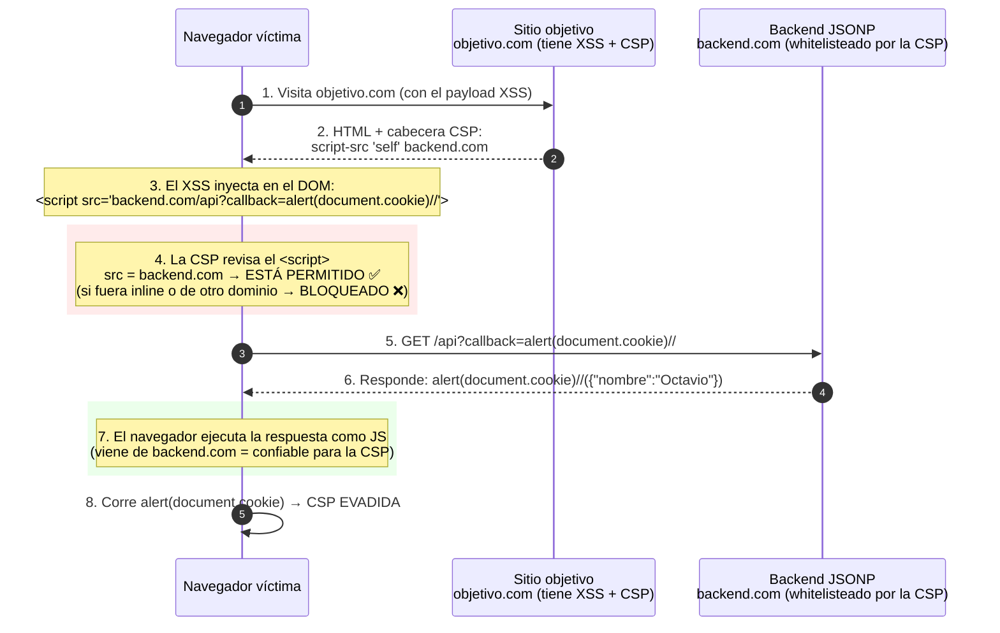

# Cómo funciona JSONP (y cómo se abusa con XSS + CSP)

## 1. Qué es JSONP en una línea

**JSONP** = un endpoint que en vez de devolver JSON pelado, te devuelve una
**llamada a una función** cuyo nombre vos elegís con el parámetro `callback`.
El navegador lo carga como `<script>` y **ejecuta lo que venga**.

```
GET https://backend.com/api?callback=miFuncion
      ↓ el servidor responde ↓
miFuncion({"nombre":"Octavio","rol":"admin"})     ← esto es JS ejecutable
```

La clave para el ataque: **el navegador ejecuta como código todo lo que
devuelve ese endpoint**, y el nombre del callback lo controla el atacante.

### Ojo: pasás el NOMBRE de la función, no su argumento

El parámetro `callback` **no es un argumento** de la función. Es el **nombre**
de la función con la que el servidor va a **envolver** los datos. Los datos
(el JSON) los pone el servidor; vos solo elegís el envoltorio.

El servidor arma la **última línea dinámicamente** según tu `callback`:

```
?callback=setCountryCookie   →   setCountryCookie({"country":"United Kingdom"});
?callback=foo                →   foo({"country":"United Kingdom"});
?callback=alert(1)//         →   alert(1)//({"country":"United Kingdom"});
                                  └──────┘ tu texto reflejado tal cual
```

Es decir: **el `callback` de la query se refleja literalmente al principio de
la respuesta JS**, y después el servidor le pega `(...datos...)`. Por eso, si
en vez de un nombre de función metés código (`alert(1)//`), ese código termina
ejecutándose. Ahí está el bug.

### ¿Se hace todo del tirón? Sí

En **una sola request** pasa todo, no hay segundo paso:

1. El navegador pide `<script src="...?callback=setCountryCookie">`.
2. El servidor responde el archivo + la línea `setCountryCookie({...})`.
3. El navegador **ejecuta la respuesta como JS** → la función se llama sola,
   al instante, con los datos ya adentro.

Cargar el script **es** ejecutar el callback. No tenés que llamarlo vos después.

---

## 2. Tu escenario: XSS en el sitio objetivo + endpoint JSONP

Los 3 actores:

| Actor | Rol |
|-------|-----|
| **Navegador del usuario (víctima)** | Ejecuta lo que le llega |
| **Sitio objetivo** (`objetivo.com`) | Tiene un XSS, pero se protege con una **CSP** |
| **Backend con JSONP** (`backend.com`) | Un tercero de confianza que expone un endpoint JSONP |

La pregunta central: *"si por XSS meto un `<script>`, ¿qué lo bloquea?"*

**Lo que lo bloquea = la CSP (Content Security Policy).**

`objetivo.com` manda una cabecera así:

```
Content-Security-Policy: script-src 'self' https://backend.com
```

Eso significa:

- ❌ **Scripts inline** (`<script>alert(1)</script>`) → **BLOQUEADOS**
- ❌ Scripts de dominios random (`<script src="malo.com/x.js">`) → **BLOQUEADOS**
- ✅ Scripts de `backend.com` → **PERMITIDOS** (está en la whitelist)

Entonces tu XSS *funciona* (podés inyectar HTML), pero la CSP no te deja
ejecutar tu JavaScript directamente. **Ahí entra JSONP como bypass:**
`backend.com` está permitido... y tiene un endpoint JSONP donde vos controlás
el `callback`. Metés tu JS dentro del nombre del callback:

```html
<!-- Inyectado por el XSS. La CSP lo PERMITE porque src apunta a backend.com -->
<script src="https://backend.com/api?callback=alert(document.cookie)//"></script>
```

El servidor responde:

```javascript
alert(document.cookie)//({"nombre":"Octavio"})
```

El `//` comenta el resto, y el navegador ejecuta `alert(document.cookie)`
como si fuera un script legítimo de `backend.com`. **CSP evadida.**

---

## 3. Diagrama de secuencia



---

## 4. Resumen del "quién bloquea a quién"

```
XSS  ──► puede inyectar HTML/<script>  ✅ (falla del objetivo)
   │
   └──► CSP ──► ¿bloquea el script?
                 │
                 ├─ inline / dominio no permitido ──► BLOQUEADO ❌
                 │
                 └─ src = backend.com (whitelisted) ──► PERMITIDO ✅
                            │
                            └─ backend tiene JSONP con callback controlable
                                       │
                                       └──► JS arbitrario ejecutado ──► CSP BYPASS 💥
```

**En resumen:** lo que "bloquea el script" es la **CSP**. El JSONP es el
agujero que permite saltarla, porque el atacante mete su código dentro del
parámetro `callback` de un dominio que la CSP considera confiable.

---

## 5. Mitigaciones

- **No usar JSONP.** Usar **CORS** para peticiones cross-origin.
- Si hay JSONP, **validar el `callback`** con lista blanca estricta
  (`^[A-Za-z0-9_]+$`) para que no se pueda meter código.
- No whitelistear en la CSP dominios que tengan endpoints JSONP
  (son "CSP-bypass gadgets" conocidos).
- Corregir el XSS de raíz (escapar/validar entrada) — es el primer eslabón.
- Marcar cookies sensibles como `HttpOnly` para que `document.cookie` no las exponga.
