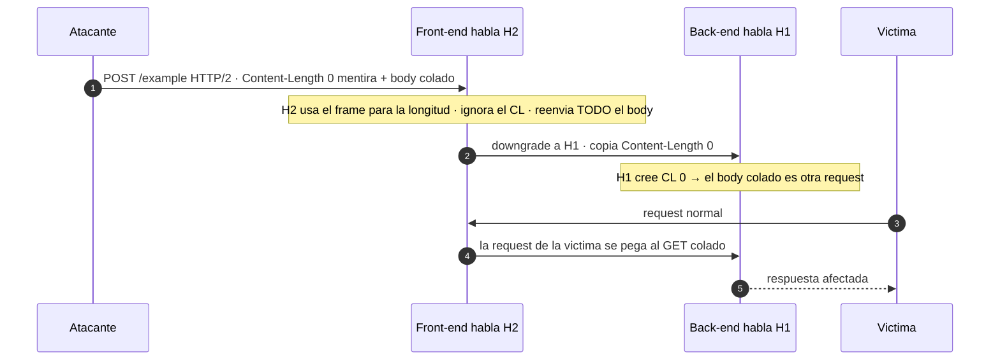

---
aliases:
  - HTTP Smuggling 004 - H2.CL
  - h2.cl
tags:
  - vuln/http-smuggling
  - example
  - portswigger
---

# 004 — H2.CL (HTTP/2 downgrade + Content-Length mentiroso)

> Lab: [H2.CL request smuggling](https://portswigger.net/web-security/request-smuggling/advanced/lab-request-smuggling-h2-cl-request-smuggling) · **Practitioner** · técnica → [[vulnerabilities/008-http_smuggling/http-smuggling|entry point]]

## ¿Por qué acá?

- **Vengo de [[vulnerabilities/008-http_smuggling/examples/001-cl-te|001]]/[[vulnerabilities/008-http_smuggling/examples/002-te-cl|002]]/[[vulnerabilities/008-http_smuggling/examples/003-te-te|003]]:** todo eso era HTTP/1.1, donde CL y TE se pelean.
- **En HTTP/2 no hay pelea:** cada request lleva su **longitud en el propio protocolo** (el frame + el flag `END_STREAM`). El `Content-Length` es **redundante** y el server ni lo necesita. Entonces… ¿dónde está el bug?
- **En el downgrade.** El front-end habla H2 con vos pero **traduce a HTTP/1.1** para hablar con el back-end. Si al traducir **copia tu `Content-Length`** (que en H2 nadie validó) a la request H1, el back-end vuelve a ser ambiguo → **revive el smuggling**.

## Concepto

**Front-end habla HTTP/2, back-end habla HTTP/1.1. Vos mandás un `Content-Length` que MIENTE.**

- **Front (H2):** para la longitud usa el **frame de H2**, no el `Content-Length` → reenvía **todo** tu body (aunque el CL diga 0).
- **Al degradar a H1:** copia tal cual tu `Content-Length: 0` a la request que le manda al back.
- **Back (H1):** lee `Content-Length: 0` → cree que el body está **vacío** → todo lo que viene después lo interpreta como el **inicio de la siguiente request** → eso es lo colado.

> [!important] El corazón del ataque: `Content-Length: 0`
> En HTTP/2 podés poner **cualquier** `Content-Length` — es mentira y el front **no lo usa** (usa el frame), así que igual reenvía tu body entero. Pero al **degradar** lo copia a H1, y el back-end **sí le cree**. Con `0`, el back piensa "no hay body" y empieza a leer tu payload como **una request nueva**. Ese descalce (front ignora el CL / back le cree) **es** el H2.CL.

---

## Cómo explotarlo

> [!info] Cómo leer los colores
> <b>■ Rojo = el header-mentira</b> que habilita todo (no lo cambiás, pero es el corazón). <b>■ Naranja = lo que cambiás VOS</b> (la request colada). <b>■ Azul = la CONSECUENCIA</b> (el `Content-Length` interno y los bytes que "se traga" del próximo usuario).

<pre>
POST /example HTTP/2
Host: vulnerable-website.com
Content-Type: application/x-www-form-urlencoded
<b>Content-Length: 0</b>

<b>GET /admin HTTP/1.1
Host: vulnerable-website.com
Content-Length: 10

x=1</b><b>GET / H</b>
</pre>

- <b>Rojo</b> (`Content-Length: 0`): la mentira. El front la ignora (reenvía todo), el back le cree (body vacío) → lo de abajo queda colado.
- <b>Naranja</b>: la request que colás (`GET /admin …`). Vos elegís qué pedir.
- <b>Azul</b>: la **consecuencia**. El `Content-Length: 10` **interno** hace que el back **espere 10 bytes de body**: `x=1` (3) + los primeros **7 bytes de la request del próximo usuario** (`GET / H`). Así el smuggled queda bien formado y **se traga el arranque de la request de la víctima**.

> Regla mental H2.CL: **rojo = mentís la longitud · naranja = qué colás · azul = cuánto del próximo request te comés.**

**Mandalo 2 veces:** la 1ª deja el `GET /admin` esperando en el socket back; la 2ª (o la de la víctima) lo completa y dispara.

## Detección

En H2 el timing es poco fiable (el front no se cuelga igual). Lo práctico:
1. **Diferencial:** colá un `GET /404` (mismo molde, con `Content-Length: 0`) y mirá que **tu segunda request** reciba el `404`.
2. **Extensión [HTTP Request Smuggler](https://portswigger.net/bappstore/af9cfa39a3a04478847587dc62b6c9b9)** (Burp) → tiene sondas automáticas de H2.CL / H2.TE / downgrade.

## Verificación

- **Este molde** (colar `GET /admin`): la 2ª respuesta trae el panel/acción interna.
- **Objetivo del lab 13:** este mismo desync se usa para **redirigir a la víctima** a un JS del exploit server → `alert(document.cookie)` (en vez de `GET /admin`, colás un `GET //TU-EXPLOIT-SERVER/…` que la respuesta redirige).

## Detalles que se pasan por alto

- **Mandalo por HTTP/2 de verdad.** En Burp Repeater: "Send over HTTP/2", y **desactivá** que "corrija" headers. En H2 el request-line son **pseudo-headers** (`:method`, `:path`, `:authority`, `:scheme`) — Burp lo muestra como `POST /example HTTP/2` pero por dentro es eso.
- **El `Content-Length` mentiroso hay que poder escribirlo.** Burp puede bloquear headers "inválidos" en H2 → habilitá la opción para permitirlos (o usá el kettle/Inspector).
- **Solo funciona si el front DEGRADA a H1.** Si el back también habla H2, no hay downgrade y no hay bug.
- Script (WIP): [[vulnerabilities/008-http_smuggling/scripts/h2_cl.py|h2_cl.py]] — todavía no anda bien, hoy conviene Repeater.

→ Siguiente: [[vulnerabilities/008-http_smuggling/examples/005-h2-te|005 · H2.TE (mismo downgrade, pero con Transfer-Encoding)]]
