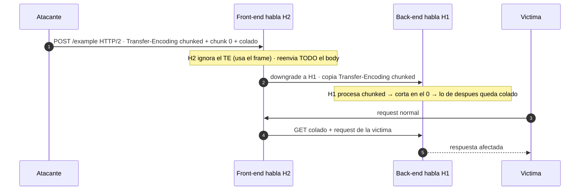

---
aliases:
  - HTTP Smuggling 005 - H2.TE
  - h2.te
tags:
  - vuln/http-smuggling
  - example
  - portswigger
---

# 005 — H2.TE (HTTP/2 downgrade + Transfer-Encoding)

> Lab: [Response queue poisoning via H2.TE](https://portswigger.net/web-security/request-smuggling/advanced/response-queue-poisoning/lab-request-smuggling-h2-response-queue-poisoning-via-te-request-smuggling) · **Practitioner** · técnica → [[vulnerabilities/008-http_smuggling/http-smuggling|entry point]]

## ¿Por qué acá?

- **Vengo de [[vulnerabilities/008-http_smuggling/examples/004-h2-cl|004 (H2.CL)]]:** ahí la mentira era el `Content-Length`.
- **Acá la mentira es el `Transfer-Encoding`.** Mismo truco de fondo (**el front degrada H2 → H1 y copia un header que no validó**), pero en vez de mentir la longitud con CL, metés `Transfer-Encoding: chunked`.
- **Ventaja:** no hay número que recalcular. El chunk `0` marca el fin y **todo lo que sigue queda colado** — más limpio que H2.CL.

## Concepto

**Front-end habla HTTP/2, back-end habla HTTP/1.1. Vos metés `Transfer-Encoding: chunked`.**

- **Front (H2):** usa el frame para la longitud → **ignora** el `Transfer-Encoding` (en H2 ni debería existir), pero **lo reenvía**.
- **Al degradar a H1:** copia tu `Transfer-Encoding: chunked` a la request del back.
- **Back (H1):** ve `chunked` → procesa chunks → **corta en el chunk `0`** (`0\r\n\r\n`). Todo lo que viene después queda como **inicio de la siguiente request** → colado.

> [!important] El corazón del ataque: `Transfer-Encoding: chunked`
> HTTP/2 **prohíbe** el `Transfer-Encoding` (la longitud la da el frame). El front debería **borrarlo**; si en cambio lo **copia** al degradar, el back-end (H1) lo obedece y empieza a leer chunks. Tu chunk `0` le dice "acá termina" → todo lo de abajo se convierte en una request nueva. Ese descuido (front ignora el TE / back lo obedece) **es** el H2.TE.

---

## Cómo explotarlo

> [!info] Cómo leer los colores
> <b>■ Rojo = el header-mentira</b> que habilita todo. <b>■ Naranja = lo que cambiás VOS</b> (la request colada). **Acá no hay azul:** el chunk `0` marca el fin, así que **no hay bytes que recalcular** (por eso H2.TE es más cómodo que H2.CL).

<pre>
POST /example HTTP/2
Host: vulnerable-website.com
Content-Type: application/x-www-form-urlencoded
<b>Transfer-Encoding: chunked</b>

0

<b>GET /admin HTTP/1.1
Host: vulnerable-website.com
Foo: bar</b>
</pre>

- <b>Rojo</b> (`Transfer-Encoding: chunked`): la mentira que el front copia al degradar → el back procesa chunks.
- El `0` + línea en blanco = chunk de cierre. El back corta ahí.
- <b>Naranja</b>: la request colada. Va **después** del `0` y no necesita ningún conteo — se cuela entera.

> Regla mental H2.TE: **rojo = metés el TE prohibido · `0` cierra · naranja = lo que colás.** Sin matemática de bytes.

**Mandalo 2 veces:** la 1ª deja el `GET /admin` esperando; la 2ª (o la de la víctima) lo dispara.

## Detección

Igual que H2.CL: el timing es poco fiable en H2.
1. **Diferencial:** colá `GET /404` (después del `0`) y mirá que **tu segunda request** reciba el `404`.
2. **[HTTP Request Smuggler](https://portswigger.net/bappstore/af9cfa39a3a04478847587dc62b6c9b9)** → sondas automáticas de downgrade H2.TE.

## Verificación

- **Este molde** (colar `GET /admin`): la 2ª respuesta trae la acción interna.
- **Objetivo del lab 14 (response queue poisoning):** con H2.TE colás una **request completa** que desincroniza la **cola de respuestas** → empezás a recibir las respuestas de **otros usuarios** (capturás la cookie del admin al loguearse) → `/admin` → **borrar carlos**.

## Detalles que se pasan por alto

- **H2.TE es más limpio que H2.CL:** el chunk `0` cierra solo → nada que contar. Si podés elegir, probá H2.TE primero.
- **Mismos requisitos que H2.CL:** mandarlo por HTTP/2 real, permitir el header "prohibido", y que el front **degrade** a H1.
- El `Transfer-Encoding` en H2 va como header normal en el Inspector de Burp; asegurate de que **no lo borre** al enviar.
- Script (WIP): [[vulnerabilities/008-http_smuggling/scripts/h2_te.py|h2_te.py]] y [[vulnerabilities/008-http_smuggling/scripts/h2_rqp.py|h2_rqp.py]] — todavía no andan bien.

→ Siguiente: [[vulnerabilities/008-http_smuggling/examples/006-cl-0|006 · CL.0 (el back ignora el CL)]]
