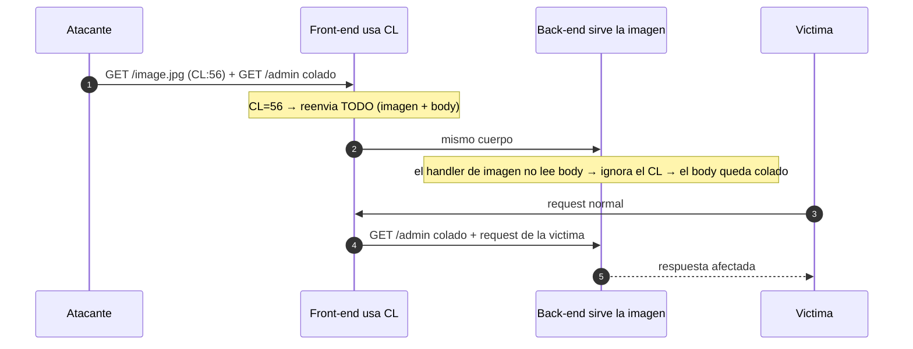

---
aliases:
  - HTTP Smuggling 006 - CL.0
  - cl.0
tags:
  - vuln/http-smuggling
  - example
  - portswigger
---

# 006 — CL.0 (el back ignora el Content-Length)

> Lab: [CL.0 request smuggling](https://portswigger.net/web-security/request-smuggling/browser/cl-0/lab-cl-0-request-smuggling) · **Practitioner** · técnica → [[vulnerabilities/008-http_smuggling/http-smuggling|entry point]]

## ¿Por qué acá?

- **Vengo de todo lo anterior:** hasta ahora el desync venía de que **CL y TE se contradecían**. Acá **no hay TE en juego** — solo `Content-Length`.
- **La clave está en QUÉ endpoint pegás.** Algunos recursos del back-end **no leen el body de la request** (imágenes, CSS, JS, redirects…). Para ellos, un `GET` con body es raro → **ignoran el `Content-Length` y lo tratan como 0**.
- **Resultado:** el front (que sí usa CL) reenvía todo; el back atiende la imagen, **descarta el body** y lo que quedó en el socket lo lee como **la siguiente request** → colado.

## Concepto

**Front-end usa `Content-Length`; el back-end lo IGNORA (lo trata como 0) en ese endpoint.**

- **Front (CL):** cuenta bytes → reenvía **toda** la request, imagen + body.
- **Back (endpoint estático):** el handler de la imagen **no espera body** → responde el `.jpg` y **no consume** los bytes del body → esos bytes quedan en el socket como **inicio de otra request**.
- Por eso funciona **principalmente en recursos como imágenes** (y otros endpoints que no leen body).

> [!important] Por qué funciona: el endpoint estático no acepta body
> Un `GET` a una imagen **no tiene por qué llevar body**. El handler que sirve el `.jpg` responde mirando solo la URL y **no lee el `Content-Length`** → para él el cuerpo "no existe" (CL = 0). El front, en cambio, **sí** respeta el CL y reenvía todo. Ese desacuerdo (front cuenta / back ignora) **es** el CL.0. Por eso el ataque **depende de elegir un endpoint que ignore el body** — típicamente **archivos estáticos** (imágenes, CSS, JS) o redirects.

---

## Cómo explotarlo

> [!info] Cómo leer los colores
> <b>■ Rojo = lo que habilita el ataque</b>: el endpoint estático que ignora el body (acá, una imagen). <b>■ Naranja = lo que cambiás VOS</b> (la request colada). <b>■ Azul = la CONSECUENCIA</b> (el `Content-Length` = longitud del naranja).

<pre>
<b>GET /image/blog/posts/46.jpg HTTP/1.1</b>
Host: 0a66008a036e593281b603d900600091.web-security-academy.net
Cookie: session=0dw1wmLQjYId7XL5TPStOFW8DS4GQdSK
Content-Length: <b>56</b>

<b>GET /admin/delete?username=carlos HTTP/1.1
X-Ignore: as</b>
</pre>

- <b>Rojo</b>: la request "portadora" tiene que ir a un **endpoint que ignore el body** (`/image/blog/posts/46.jpg`). Si pegás a uno que **sí** lee body, no cuela → hay que **buscar** el endpoint bueno.
- <b>Naranja</b>: la request colada. `X-Ignore: as` (sin línea en blanco final) es un header "colador": la request de la víctima que venga después se pega ahí y no rompe el parseo.
- <b>Azul</b>: `Content-Length: 56` = longitud EXACTA del bloque naranja (`GET /admin/delete?username=carlos HTTP/1.1\r\nX-Ignore: as` = 56 bytes). Cambiás el naranja → recalculás el 56.

> Regla mental CL.0: **rojo = un endpoint que no lee body (imagen) · naranja = qué colás · azul = su longitud en el CL.**

**Mandalo 2 veces:** la 1ª deja el `GET /admin/delete` esperando; la 2ª (o la de la víctima) lo completa y dispara.

## Detección

1. **Elegí un recurso estático** (imagen/CSS/JS) y mandale una request con **body** + un prefijo colado `GET /404 …`. Si **tu segunda request** recibe el `404` → ese endpoint ignora el CL → **CL.0 confirmado**.
2. **Probá varios endpoints:** no todos ignoran el body; los estáticos son los primeros candidatos.
3. **Extensión [HTTP Request Smuggler](https://portswigger.net/bappstore/af9cfa39a3a04478847587dc62b6c9b9)** → tiene sonda específica de CL.0.

## Verificación

- La 2ª respuesta trae el efecto del smuggled (`carlos` borrado / panel admin).
- **Objetivo del lab 19:** identificar el endpoint vulnerable, colar a `/admin` y **borrar carlos**.

## Detalles que se pasan por alto

- **El endpoint es TODO.** CL.0 no depende de TE ni de contradicción de headers: depende de encontrar un handler que **no lea el body**. Imágenes primero.
- **`X-Ignore` sin CRLF final:** dejar el smuggled "abierto" con un header dummy hace que lo que venga después (la request de la víctima) se folde ahí y no ensucie.
- **CL bien contado** = longitud del bloque colado (igual que CL.TE).
- **Repeater:** "Update Content-Length" **desactivado**.
- **Primo browser-powered:** si el desync lo dispara el **propio navegador de la víctima** (no vos), es un **client-side desync** → *(pendiente)*.

→ Siguiente: [[vulnerabilities/008-http_smuggling/examples/007-response-queue-poisoning|007 · Response Queue Poisoning (robar respuestas ajenas)]]
