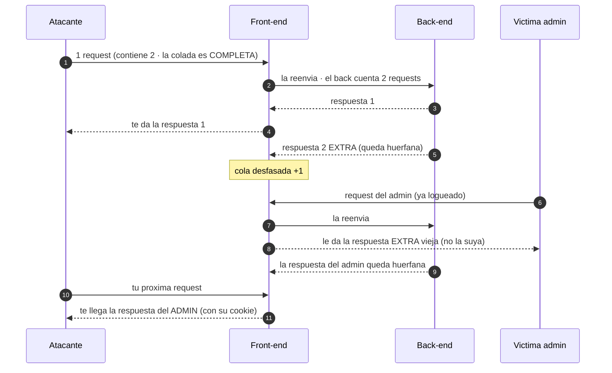

---
aliases:
  - HTTP Smuggling 007 - Response Queue Poisoning
  - response queue poisoning
  - desincronizacion de cola
  - RQP
tags:
  - vuln/http-smuggling
  - example
  - portswigger
---

# 007 — Response Queue Poisoning (robar respuestas ajenas)

> Labs: [Response queue poisoning via H2.TE](https://portswigger.net/web-security/request-smuggling/advanced/response-queue-poisoning/lab-request-smuggling-h2-response-queue-poisoning-via-te-request-smuggling) · [HTTP/2 request splitting via CRLF](https://portswigger.net/web-security/request-smuggling/advanced/lab-request-smuggling-h2-request-splitting-via-crlf-injection) · **Practitioner** · técnica → [[vulnerabilities/008-http_smuggling/http-smuggling|entry point]]

## ¿Por qué acá? (no es una variante, es qué HACÉS con el desync)

- **Hasta ahora colábamos un PREFIJO** (media request): esperaba a que la request de la víctima lo **completara**.
- **Acá colás una request COMPLETA.** Eso hace que el back-end genere **una respuesta de más** de la que el front no lleva registro → **se desfasa la cola de respuestas** → a partir de ahí **cada uno recibe la respuesta del anterior**.
- Sirve para lo más goloso: **recibir la respuesta de OTRO usuario** (la del `administrator` recién logueado, con su `Set-Cookie` / su panel).

## Concepto

El front-end y el back-end comparten **una conexión reusada** para varios usuarios. La regla es simple: **1 request enviada = 1 respuesta que el front devuelve** al cliente que la mandó (FIFO).

1. Mandás **1** request que el back ve como **2** (la 2ª colada, **completa y bien cerrada**).
2. El back produce **2 respuestas**. El front te da la 1ª y **la 2ª queda huérfana** en el buffer.
3. La cola quedó **desfasada +1**: el **próximo** que use esa conexión recibe la **respuesta sobrante** (no la suya), y la suya queda huérfana para el siguiente…
4. Vos seguís mandando requests y **vas cobrando las respuestas de otros** → cuando el admin se loguea, **su** respuesta te llega **a vos**.

> [!important] La condición que lo hace posible
> La request colada tiene que ser **COMPLETA** (con su fin bien marcado) para que genere una respuesta entera de más. Un prefijo incompleto **no** desfasa la cola: solo captura. Y la **conexión front↔back tiene que reusarse** entre usuarios (keep-alive normal).

---

## ¿En qué protocolos funciona?

RQP no es de un protocolo: **funciona con cualquier primitivo que te deje colar una request completa.** Lo que cambia es **cómo** conseguís el desync.

| Primitivo | Protocolo | Notas |
| --- | --- | --- |
| **CL.TE / TE.CL** | HTTP/1.1 | Clásico: colás una request completa con el desync de [[vulnerabilities/008-http_smuggling/examples/001-cl-te\|001]]/[[vulnerabilities/008-http_smuggling/examples/002-te-cl\|002]]. |
| **H2.TE** | HTTP/2 → downgrade a H1 | **Lab 14.** El downgrade te regala el primitivo; metés `chunked` y una request completa → [[vulnerabilities/008-http_smuggling/examples/005-h2-te\|005]]. |
| **H2.CL** | HTTP/2 → downgrade a H1 | Igual con `Content-Length` mentiroso → [[vulnerabilities/008-http_smuggling/examples/004-h2-cl\|004]]. |
| **H2 request splitting (CRLF)** | HTTP/2 | **Lab 16.** Inyectás `\r\n` en un header H2 para **partir** tu request en dos completas → RQP. |

> No aplica (o cuesta) si la conexión **no se reusa** entre clientes, o si el front **cierra** la conexión ante cualquier rareza.

---

## RQP vs. "capturar la request" (no confundir)

| | **Capturar request** (lab 9) | **Response queue poisoning** (labs 14, 16) |
| --- | --- | --- |
| Qué colás | Un **prefijo** con `Content-Length` **grande** | Una request **completa** |
| Qué obtenés | La **request** del próximo usuario (queda en un campo que leés) | La **respuesta** del próximo usuario (te llega directo) |
| Cómo la leés | En un comentario/campo almacenado | En tu propia siguiente respuesta |
| Típico botín | Su cookie dentro de **su request** | Su `Set-Cookie` / su página autenticada en **su respuesta** |

---

## Cómo explotarlo

> [!info] Cómo leer los colores
> <b>■ Rojo = el header que arma el desync</b> (acá `Transfer-Encoding` vía downgrade H2.TE). <b>■ Naranja = la request COMPLETA que colás</b> — fijate que **cierra** (no queda esperando nada). Sin azul: no hay conteo, lo importante es que sea **una request entera**.

Ejemplo con H2.TE (lab 14): colás un `GET /` completo al back para meter la respuesta de más:

<pre>
POST /example HTTP/2
Host: vulnerable-website.com
<b>Transfer-Encoding: chunked</b>

0

<b>GET /x HTTP/1.1
Host: vulnerable-website.com

</b>
</pre>

- <b>Rojo</b>: el `Transfer-Encoding` que el front copia al degradar → el back procesa chunks y corta en el `0`.
- <b>Naranja</b>: la request **completa** (`GET /x` con su `Host` y su **línea en blanco final**). Al estar cerrada, el back emite una **respuesta entera de más** → desfase.

**Cómo cobrás la respuesta ajena:**
1. Mandás el request de arriba (envenena la cola).
2. **Repetís** requests normales en la **misma conexión** (Repeater → "Send" varias veces, o grupo de requests con *single connection*).
3. En algún momento **una respuesta no coincide con tu request**: trae el HTML/`Set-Cookie` de **otro usuario** (el admin). Ese es el botín.

## Verificación

- Recibís una respuesta **que no corresponde** a lo que pediste (código, longitud o contenido de otra request).
- **Lab 14:** capturás la respuesta del **admin al loguearse** → su cookie de sesión → `/admin` → **borrar carlos**.

## Detalles que se pasan por alto

- **Completa = la clave.** Si el smuggled no cierra bien, capturás en vez de desfasar. Poné su `Host` y su **línea en blanco final**.
- **Reuso de conexión:** en Burp Repeater agrupá las requests y enviálas por **una sola conexión** para ver el desfase.
- **Rompés a usuarios reales** mientras la cola está desfasada → como todo smuggling ofensivo, cuidado fuera de un lab.
- **HTTP/2:** mandá por H2 real y permití el header "prohibido" (igual que [[vulnerabilities/008-http_smuggling/examples/005-h2-te|005]]). Scripts (WIP): [[vulnerabilities/008-http_smuggling/scripts/h2_rqp.py|h2_rqp.py]].

→ Siguiente: *(0.CL · client-side desync · pause-based · pendientes)*
