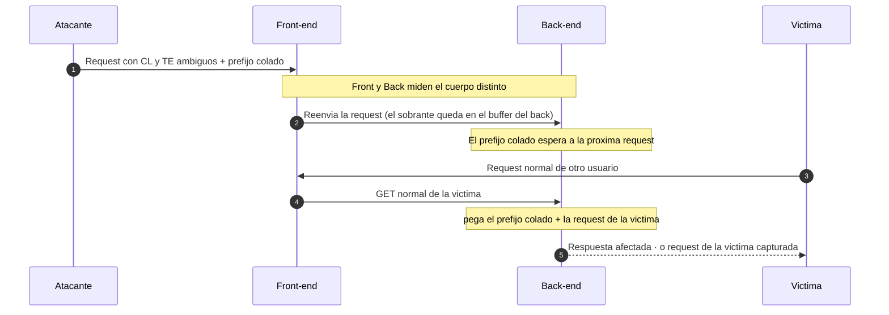

---
aliases:
  - HTTP Request Smuggling
  - request-smuggling-entrypoint
  - HTTP Desync
  - smuggling
tags:
  - vuln/http-smuggling
  - entrypoint
---

# HTTP Request Smuggling — Punto de entrada

> Documento **agnóstico al negocio**: *cómo **detectar y explotar** el desync*.
> **Objetivo + técnica por lab** → [[vulnerabilities/008-http_smuggling/labs/README|labs/README]].
> **Dónde** aplica (qué endpoint, qué front-end) → eso vive en los `STAGE_x`.

> [!abstract] La idea en una línea
> Entre vos y la app hay **dos servidores en cadena** (front-end/proxy → back-end). Si **discrepan en dónde termina tu request**, colás el **inicio de una segunda request** dentro de la primera. El front la reenvía entera; el back la **parte mal** y trata tus bytes colados como la **request del próximo usuario** → saltás controles del front, robás requests/cookies ajenas, o inyectás XSS/redirects a otros.

## 📚 Referencias rápidas

- 🧪 **Laboratorios** — 22 labs (15 Practitioner + 7 Expert), objetivo + técnica por lab → [[vulnerabilities/008-http_smuggling/labs/README|labs/README]]
- 🐍 **Ejemplos / PoCs** (del más simple al más rebuscado):
    - [[vulnerabilities/008-http_smuggling/examples/001-cl-te|001 · CL.TE]] · [[vulnerabilities/008-http_smuggling/examples/002-te-cl|002 · TE.CL]] · [[vulnerabilities/008-http_smuggling/examples/003-te-te|003 · TE.TE (ofuscación)]]
    - HTTP/2: [[vulnerabilities/008-http_smuggling/examples/004-h2-cl|004 · H2.CL]] · [[vulnerabilities/008-http_smuggling/examples/005-h2-te|005 · H2.TE]]
    - [[vulnerabilities/008-http_smuggling/examples/006-cl-0|006 · CL.0 (recursos estáticos)]]
    - Explotación: [[vulnerabilities/008-http_smuggling/examples/007-response-queue-poisoning|007 · Response Queue Poisoning]]
    - *(0.CL, client-side desync, pause-based → pendientes)*
- 🛠️ **Scripts** (Python, socket crudo) → [[vulnerabilities/008-http_smuggling/scripts/detect.py|detect.py]] · [[vulnerabilities/008-http_smuggling/scripts/cl_te.py|cl_te.py]] · [[vulnerabilities/008-http_smuggling/scripts/te_cl.py|te_cl.py]]

## 🎯 Cuándo hay smuggling (condiciones)

1. **Hay una cadena de servers** — un front-end/proxy/CDN/load-balancer delante de un back-end (pistas: headers `Via`, `X-Forwarded-*`, `X-Cache`, `Server` distinto según ruta).
2. **Podés mandar `Content-Length` y `Transfer-Encoding` juntos** sin que te rechacen — o el front habla **HTTP/2 y lo degrada** a HTTP/1.1.
3. **Los dos resuelven la longitud del cuerpo distinto.** Ahí nace el desync.

## 🧪 Cómo detectarlo

Dos enfoques (timing y respuesta diferencial). Pero antes que el "cómo", va el **orden**, porque **una de las dos sondas contamina la conexión**.

> [!danger] El orden importa: **CL.TE primero, TE.CL último**
> **Siempre probá CL.TE antes que TE.CL.** ¿Por qué?
> - La sonda **CL.TE no contamina el socket:** el front (CL) descarta el sobrante → no queda nada pegado para nadie.
> - La sonda **TE.CL SÍ contamina el socket:** deja un byte suelto que se pega al inicio de la request del **próximo usuario** → si el sitio resulta ser TE.CL y sondeaste sin cuidado, **rompés a otros usuarios**.
>
> **Procedimiento seguro:**
> 1. Probá **CL.TE** (Caso A o B). Si da positivo → listo, es CL.TE.
> 2. **Solo si CL.TE dio negativo**, probá **TE.CL** — y ahí preferí el **Caso B (404)**, que no ensucia nada.
>
> Regla nemotécnica: *el que contamina se prueba al final.* El que contamina es **TE.CL**.

### Caso A — por *timing* (timeout)

Mandás un cuerpo **ambiguo a propósito** para que **un** server se quede esperando bytes que nunca llegan → la respuesta **tarda** (se cuelga hasta el timeout). Si responde rápido, no es vulnerable a esa variante.

| Variante | ¿Contamina el socket? | Por qué |
| --- | --- | --- |
| **CL.TE** | ✅ **No** (seguro) | El front (CL) reenvía **solo lo que dice el CL** y descarta el sobrante → no queda nada pegado para el próximo usuario. Sonda → [[vulnerabilities/008-http_smuggling/examples/001-cl-te#detección-caso-a-timeout|ejemplo 001]]. |
| **TE.CL** | ⚠️ **Sí** (riesgoso) | El front (TE) corta en el chunk `0` y **deja un byte suelto** que se pega al inicio de la request del **próximo usuario** → lo corrompés. Sonda → [[vulnerabilities/008-http_smuggling/examples/002-te-cl#detección-caso-a-timeout|ejemplo 002]]. |

> [!warning] El timing engaña
> Un server lento de por sí da **falsos positivos**. Corré una **baseline** (request normal) antes. Y **nunca** uses el timing de TE.CL en un target compartido/producción ajena: podés tirar a otros usuarios. Para eso está el Caso B.

### Caso B — por *respuesta diferencial* (404) · **preferido**

En vez de colgar el server, colás una request a una **ruta inexistente** y observás que **la siguiente request normal recibe un `404`** (o algo distinto):

1. Mandás la **sonda** (una request válida con un prefijo colado tipo `GET /404 HTTP/1.1`).
2. **Inmediatamente después**, una request **normal** a `/`.
3. Si la normal vuelve con **`404`** → tu prefijo se le pegó adelante → **smuggling confirmado**.

No depende de timeouts, es repetible y **no corrompe** a terceros (el efecto lo recibís **vos** en tu segunda request). Payloads exactos → [001 · Caso B](vulnerabilities/008-http_smuggling/examples/001-cl-te.md) y [002 · Caso B](vulnerabilities/008-http_smuggling/examples/002-te-cl.md).

> [!tip] Detección en una frase
> **Diferencial (404) > timing.** Y siempre **CL.TE antes que TE.CL**.

---

## 🧩 El nombre dice quién usa qué

La discrepancia siempre es sobre **cuánto mide el cuerpo**. Dos formas de decirlo: **`Content-Length` (CL)** cuenta bytes; **`Transfer-Encoding: chunked` (TE)** cierra con un chunk `0`.

| Nombre | Front-end usa | Back-end usa | Idea |
| --- | --- | --- | --- |
| **CL.TE** | CL | TE | Front reenvía todo (CL); back corta en el chunk `0` → sobra queda colado. → [[vulnerabilities/008-http_smuggling/examples/001-cl-te\|001]] |
| **TE.CL** | TE | CL | Front corta en el chunk `0`; back cuenta bytes (CL) → lo que sobra es "otra request". → [[vulnerabilities/008-http_smuggling/examples/002-te-cl\|002]] |
| **TE.TE** | TE | TE | Ambos aceptan TE → **ofuscás** el header para que **uno lo ignore** y caiga a CL → se vuelve CL.TE o TE.CL. → [[vulnerabilities/008-http_smuggling/examples/003-te-te\|003]] |
| **CL.0** | CL | (ignora CL) | El back trata el `Content-Length` como 0 en endpoints que **no leen body** (imágenes, estáticos). → [[vulnerabilities/008-http_smuggling/examples/006-cl-0\|006]] |
| **0.CL** | (ignora CL) | CL | El front ve `CL: 0` y el back sí lee el cuerpo *(pendiente)*. |
| **H2.CL** | H2 (frame) | CL | Front habla H2 (usa el frame, ignora el CL) pero **degrada a H1 copiando un `Content-Length` mentiroso**; el back (H1) le cree. → [[vulnerabilities/008-http_smuggling/examples/004-h2-cl\|004]] |
| **H2.TE** | H2 (frame) | TE | Igual, pero copia un `Transfer-Encoding: chunked` que el back (H1) obedece. → [[vulnerabilities/008-http_smuggling/examples/005-h2-te\|005]] |

> **H2.CL / H2.TE** son un eje distinto: el bug no es CL-vs-TE, es el **downgrade HTTP/2 → HTTP/1.1** que reintroduce un header que en H2 no valía nada.

## 🗺️ Qué pasa por dentro (el desync)



---

## 🔧 Cómo explotar (patrón general)

1. **Confirmá la variante** (Caso A o B) → sabés quién usa CL y quién TE.
2. **Armá el `SMUGGLED`**: no un texto suelto, una **request HTTP completa** con sus headers:
   ```http
   GET /admin HTTP/1.1
   Host: localhost
   Content-Type: application/x-www-form-urlencoded
   Content-Length: 15

   x=1
   ```
   - El **`Content-Length` del smuggled bien grande** hace que el back **espere más bytes** → se **come el inicio de la request del próximo usuario** (así la capturás, o forzás que tu prefijo se ejecute en su sesión).
   - El body `x=1` es relleno para que el parseo no falle mientras espera.
3. **Cuidá los bytes exteriores** (varía por variante — ver cada ejemplo):
   - **CL.TE:** el CL exterior = **longitud total** del cuerpo (`0\r\n\r\n` + smuggled).
   - **TE.CL:** el CL exterior = **dígitos del tamaño hex + 2** (`\r\n`); el **tamaño hex** debe ser la **longitud del smuggled**.
4. **Mandá 2 veces:** la 1ª **envenena** la conexión; la 2ª (tuya o de la víctima) **dispara** el efecto.

> [!warning] Higiene obligatoria
> - **Request cruda:** en Repeater desactivá **"Update Content-Length"**, o usá los scripts Python (socket crudo). Cualquier librería que "arregle" tus headers te rompe el ataque.
> - **Terminadores `\r\n` exactos.** Un `\n` suelto o un espacio de más y no cuela.
> - **CL.TE primero, timing con cuidado, diferencial cuando puedas.**

---

> [!tip] Reglas mentales
> - **Nombre = quién usa qué:** `CL.TE` (front CL / back TE) · `TE.CL` (front TE / back CL).
> - **Detección:** diferencial (404) es más seguro que timing; CL.TE no contamina, TE.CL sí.
> - **Escalera de impacto:** probar el desync (`GPOST`) → saltar el front hacia `/admin` (**borrar carlos**) → robar la request/cookie del próximo usuario → XSS/redirect a la víctima → envenenar **caché** (afecta a todos).
> - **Enviar 2 veces** casi siempre.

> [!note] Relación con otras vulns
> - **Host header injection** — combinás `Host: localhost` en el smuggled para llegar a `/admin` → carpeta `vulnerabilities/016-host-header-injection/`.
> - **XSS / cache poisoning** — el smuggling es el **vehículo** para entregarlos a otros usuarios (labs 10, 11, 18).
> - **CSRF** — no confundir: en CSRF la víctima manda la request; acá **vos** colás bytes que el server pega a la request de la víctima.
