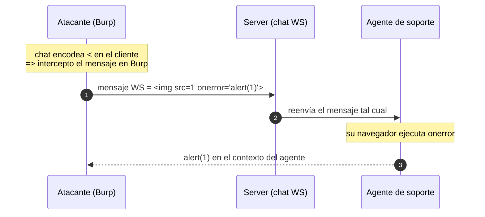

---
aliases:
  - WS 001 - manipular mensaje XSS
  - websocket message XSS
tags:
  - vuln/websocket
  - example
  - portswigger
---

# 001 — Manipular el MENSAJE (XSS por WebSocket)

> Lab: [Manipulating WebSocket messages to exploit vulnerabilities](https://portswigger.net/web-security/websockets/lab-manipulating-messages-to-exploit-vulnerabilities) · **Apprentice** · Teoría → [[vulnerabilities/012-websockets/labs/README|labs]] · [[vulnerabilities/012-websockets/websocket|entry point]]

## Qué muestra
El chat **sanitiza en el navegador** (encodea `<`), pero esa defensa es **solo client-side**. Interceptás el mensaje WS en Burp **antes de que salga** y mandás el payload **crudo** → el server lo reenvía al agente de soporte, cuyo navegador lo ejecuta.

## Por qué funciona
- La sanitización corre en **tu** navegador; al inyectar por Burp te la **salteás**.
- El mensaje WS es un dato más que el server **reenvía sin re-sanitizar** al otro extremo.

## Diagrama



## Cómo explotarlo (paso a paso)
1. Mandá un mensaje cualquiera en el chat → aparece en **Proxy → WebSockets history**.
2. Con **Intercept** activo (o desde **Repeater**, pestaña WebSocket), editá el texto del mensaje a:
   ```html
   
   ```
3. **Forward** / **Send** → el server lo reenvía al agente → `alert(1)`.

## Verificación
- Salta el `alert()` en el navegador del agente (el lab se marca resuelto).

## Detalles que se pasan por alto
- Un WS es **HTTP con otro traje**: dentro del mensaje probá las mismas vulns que en un parámetro (XSS, SQLi, command injection).
- Si el payload directo no dispara, **ofuscá** → [[vulnerabilities/019-obfuscacion/xss-obfuscation|xss-obfuscation]] (lo necesitás en el 002).

→ Siguiente: [[vulnerabilities/012-websockets/examples/002-handshake-ip-spoof-filtro|002 · manipular el handshake]]
