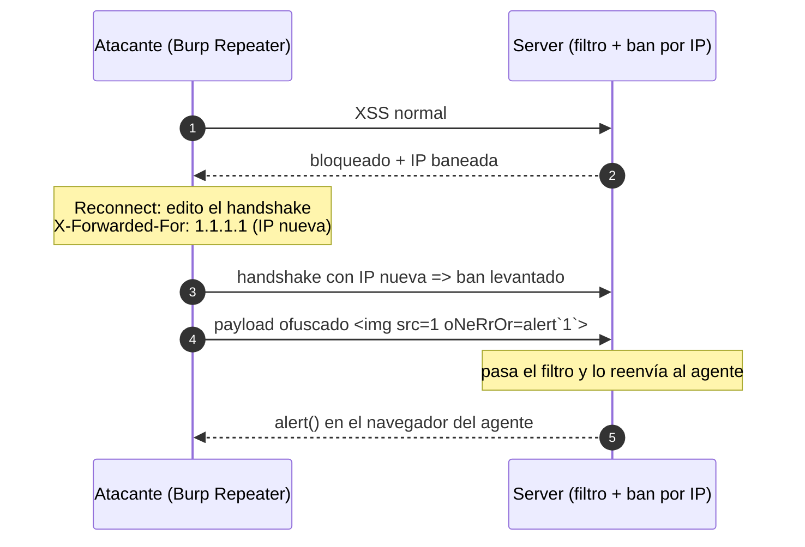

---
aliases:
  - WS 002 - manipular handshake
  - websocket X-Forwarded-For ban bypass
tags:
  - vuln/websocket
  - example
  - portswigger
---

# 002 — Manipular el HANDSHAKE (IP spoof + evadir filtro)

> Lab: [Manipulating the WebSocket handshake to exploit vulnerabilities](https://portswigger.net/web-security/websockets/lab-manipulating-handshake-to-exploit-vulnerabilities) · **Practitioner** · Teoría → [[vulnerabilities/012-websockets/labs/README|labs]] · [[vulnerabilities/012-websockets/websocket|entry point]]

## Qué muestra
Hay un **filtro XSS agresivo** que además **banea tu IP** al detectar un payload. Dos problemas: el filtro y el ban. Los resolvés en **dos capas**: el ban con un header en el **handshake** (`X-Forwarded-For`), el filtro con un payload **ofuscado**.

## Por qué funciona
- El **handshake es un request manipulable**: podés reconectar editando sus headers.
- El server confía en `X-Forwarded-For` para decidir la IP → mandás una nueva y **se levanta el ban**.
- El filtro compara patrones simples → un event handler en **mixed-case** + backticks lo **evade**.

## Diagrama



## Cómo explotarlo (paso a paso)
1. Probá un XSS normal → el filtro lo bloquea y **te banea la IP** (los siguientes mensajes fallan).
2. En **Repeater** → **Reconnect** y editá el **handshake** agregando:
   ```
   X-Forwarded-For: 1.1.1.1
   ```
   (IP nueva → ban levantado).
3. Mandá el payload **ofuscado** (event handler mixed-case + call con backticks):
   ```html
   
   ```
4. → `alert()` en el navegador del agente.

## Verificación
- El mensaje ofuscado se reenvía sin bloqueo y dispara el `alert()` en el agente.

## Detalles que se pasan por alto
- **Cada intento fallido re-banea**: cambiá el `X-Forwarded-For` a otra IP cuando lo necesites.
- Otros headers del handshake que valen la pena tocar: `Origin` (para CSWSH, ver 003) y `Cookie`.
- Más variantes de ofuscación → [[vulnerabilities/019-obfuscacion/xss-obfuscation|xss-obfuscation]].

→ Siguiente: [[vulnerabilities/012-websockets/examples/003-cross-site-websocket-hijacking|003 · CSWSH]]
