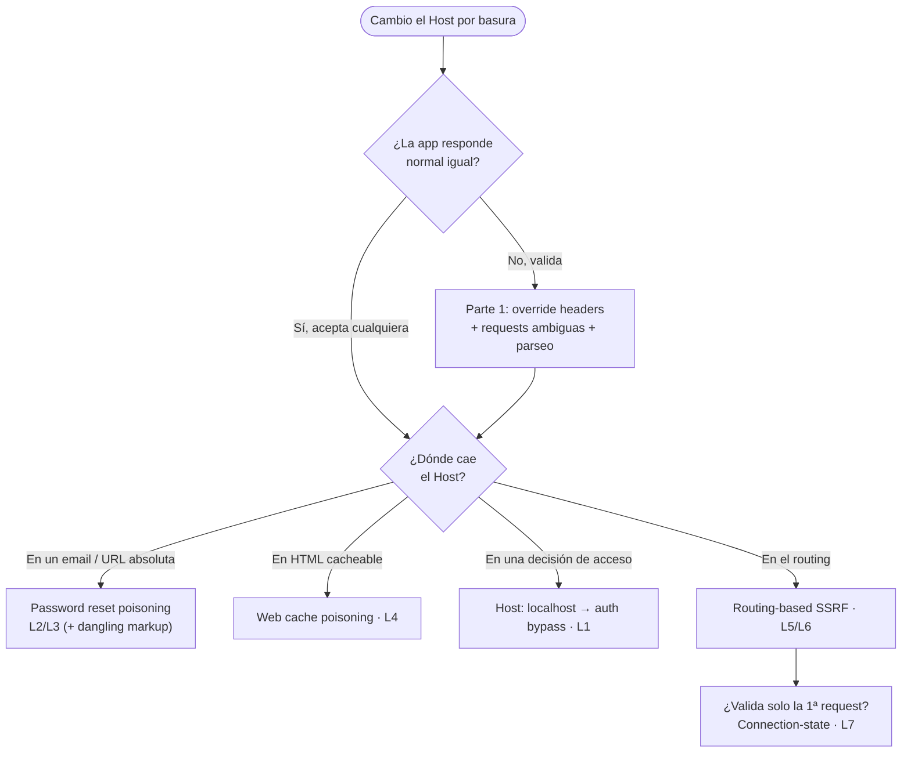

---
aliases:
  - HTTP Host header attacks
  - host-header-entrypoint
  - Host header injection
  - host header injection
  - inyeccion de host header
tags:
  - vuln/host-header
  - entrypoint
---

# HTTP Host header attacks — Punto de entrada

> Documento **agnóstico al negocio**: *cómo **detectar y explotar** ataques al header `Host`*.
> **Payloads por lab** → [[vulnerabilities/016-host-header-injection/labs/README|labs/README]].
> **Dónde** aparece (qué feature usa el Host) → eso vive en los `STAGE_x`.

> [!abstract] La idea en una línea
> La app **confía en el header `Host`** (o en `X-Forwarded-Host`) —un input que vos controlás por completo— y lo usa para algo sensible: **armar una URL absoluta** (link de reseteo, `<script src>`), **decidir un acceso** (`/admin` "solo local") o **rutear** la petición a un back-end. Vos cambiás ese valor → rompés la suposición y llegás a robar tokens, envenenar la caché, saltar auth o hacer **SSRF**.

## 📚 Referencias rápidas

- 🧪 **Laboratorios** — 7 labs (6 Practitioner + 1 Expert, **sin Apprentice**), **payload exacto por lab** → [[vulnerabilities/016-host-header-injection/labs/README|labs/README]]
- 🐍 **Script** (connection-state attack, lab 7): manda N peticiones por **una sola conexión** keep-alive arrastrando cookies + `csrf` → [[vulnerabilities/016-host-header-injection/scripts/conn_reuse.py|scripts/conn_reuse.py]]
- 🔗 **Routing-based SSRF** es un SSRF por el Host → misma familia que [[vulnerabilities/007-ssrf/ssrf|SSRF]] (targets internos, Collaborator, escaneo con Intruder).
- 🔗 **Web cache poisoning** — cuando el Host reflejado queda **fuera de la cache key** → [[vulnerabilities/030-web-cache-poisoning/web-cache-poisoning|web cache poisoning]] · [[vulnerabilities/030-web-cache-poisoning/examples/004-host-header-injection-redirect|ejemplo 004 (host header → redirect cacheado)]].
- 🔗 **Password reset poisoning** = toma de cuenta → relación con [[vulnerabilities/029-authentication/authentication|authentication]].
- 🔗 **Auth bypass por `Host: localhost`** = control de acceso roto → [[vulnerabilities/028-access-control/access-control|access control]].

## 🎯 Cuándo hay Host header attack (condiciones)

1. **El server usa el `Host` para algo que importa** — construir una URL (email, redirect, import de recurso), decidir acceso, o **rutear** la petición.
2. **Vos podés cambiar el valor** — el `Host` siempre es editable; si está validado, quedan los **headers alternativos** (`X-Forwarded-Host`…) y las **requests ambiguas**.
3. **La validación es débil o no existe** — acepta hosts arbitrarios, o parsea distinto que el back-end.

## 🧪 Cómo cazarlo (metodología)

1. **Cambiá el `Host` por basura** (`Host: bad-stuff-here`) y reenviá. ¿La app **sigue respondiendo normal** (200, misma página)? → no valida el Host = terreno fértil.
2. **Buscá dónde reaparece el valor:** en el **HTML** de la respuesta, en un `<link>/<script>` **absoluto**, en un `Location:` de redirect, o en un **email** (reset de contraseña). → *superficie reflejada*.
3. **¿Cambia el comportamiento?** Probá `Host: localhost` → ¿se abre `/admin`? *(decisión de acceso)*. Probá tu **Collaborator** en el `Host` → ¿llega interacción? *(routing/SSRF ciego)*.
4. **Si el `Host` está validado**, no te rindas: pasá a [Parte 1 — cómo colar tu valor](#parte-1--🔧-cómo-colar-tu-valor-manipular-el-host) (headers override + requests ambiguas + parseo defectuoso).
5. **Elegí la vía de explotación** según dónde cae el Host → [Parte 2 — qué se puede lograr](#parte-2--🎯-qué-se-puede-lograr-explotación).

> [!tip] La forma mental de leer todo esto
> Son **dos preguntas separadas**, no las mezcles:
> 1. **¿Cómo meto mi valor en el `Host`?** → *Parte 1* (técnica de inyección/bypass).
> 2. **¿Qué hago con ese valor una vez adentro?** → *Parte 2* (vía de explotación).
> Cualquier técnica de la Parte 1 se combina con cualquier objetivo de la Parte 2.

---

## Parte 1 — 🔧 Cómo colar tu valor (manipular el `Host`)

### A. Requests ambiguas
Cuando el front-end y el back-end **parsean distinto**, colás un segundo valor que uno ignora y el otro usa.

- **Headers `Host` duplicados** — la caché/validador mira uno, el back-end usa el otro:
```
GET /example HTTP/1.1
Host: vulnerable-website.com
Host: bad-stuff-here
```
- **URL absoluta en la request line** — algunos servers rutean por la URL y validan el `Host` aparte:
```
GET https://vulnerable-website.com/ HTTP/1.1
Host: bad-stuff-here
```
- **Line wrapping (header indentado)** — el header con espacio al principio se "esconde" de un parser pero lo ve el otro:
```
GET /example HTTP/1.1
    Host: bad-stuff-here
Host: vulnerable-website.com
```

### B. Validación defectuosa
Cuando **sí** hay validación pero es floja.

- **Puerto como vía de inyección** — validan el hostname, no el puerto → metés el payload ahí (base del **dangling markup**):
```
GET /example HTTP/1.1
Host: vulnerable-website.com:bad-stuff-here
```
- **Dominio que termina igual que la whitelist** — si valida por "termina en / contiene":
```
GET /example HTTP/1.1
Host: notvulnerable-website.com
```
- **Subdominio comprometido / arbitrario** — si valida por "es subdominio de":
```
GET /example HTTP/1.1
Host: hacked-subdomain.vulnerable-website.com
```

### C. Headers de override del Host
Si el `Host` está blindado, muchas apps confían en un header alternativo (a veces **por encima** del `Host`):

```
GET /example HTTP/1.1
Host: vulnerable-website.com
X-Forwarded-Host: bad-stuff-here
```

> Otros headers para probar cuando `X-Forwarded-Host` no anda:
> `X-Host` · `X-Forwarded-Server` · `X-HTTP-Host-Override` · `Forwarded`

---

## Parte 2 — 🎯 Qué se puede lograr (explotación)

> Cada vía = "el Host cae en tal lado → esto podés hacer". La columna **Lab** te lleva al payload concreto.

| Vía | El Host termina en… | Qué conseguís | Lab |
| --- | --- | --- | --- |
| **Password reset poisoning** | la **URL del link** del email de reseteo | el link apunta a **tu** server → robás el token de la víctima | [[vulnerabilities/016-host-header-injection/labs/README\|L2/L3]] |
| **Web cache poisoning** | el **HTML/recurso** de una respuesta **cacheable** | tu payload queda cacheado y se sirve a **todos** los usuarios | [[vulnerabilities/016-host-header-injection/labs/README\|L4]] |
| **Server-side clásico (ej. SQLi)** | una **consulta/lógica** del back-end (ej. un `INSERT` con el Host) | inyección clásica **a través** del header | — |
| **Bypass de autenticación** | una **decisión de acceso** (`Host: localhost` = interno) | entrás a paneles restringidos (`/admin`) | [[vulnerabilities/016-host-header-injection/labs/README\|L1]] |
| **Virtual host brute-forcing** | el **routing por vhost** del server | descubrís **subdominios internos** no publicados | — |
| **Routing-based SSRF** | el **routing** del front-end/load balancer | rutéas a IPs internas → **SSRF** | [[vulnerabilities/016-host-header-injection/labs/README\|L5/L6]] |
| **Connection state attacks** | el routing, **validado solo en la 1ª request** de la conexión | reusás la conexión "confiable" para colar un Host interno | [[vulnerabilities/016-host-header-injection/labs/README\|L7]] |

### Detalle de cada vía

**Password reset poisoning.** Se pisa el `Host` y el enlace de recuperación que le llega a la víctima apunta a tu dominio → cuando lo abre, su token de reseteo cae en tu access log. Si no controlás la URL entera pero el email es **HTML** (un template), inyectás **dangling markup** por el puerto/Host para exfiltrar el token igual → [dangling markup (PortSwigger)](https://portswigger.net/web-security/cross-site-scripting/dangling-markup). *(Labs 2 y 3.)*

**Web cache poisoning.** Si el Host se **retorna dentro del HTML** (o en un `<script src>` absoluto) **y** esa respuesta se **cachea**, tu valor malicioso se guarda en la caché y se sirve a otros → [web cache poisoning (topic)](https://portswigger.net/web-security/web-cache-poisoning). *(Lab 4; ver también [[vulnerabilities/030-web-cache-poisoning/web-cache-poisoning|el topic completo en el vault]].)*

**Server-side clásico.** El Host es un input más: si termina en una **sentencia SQL**, un log, o cualquier sink server-side, tenés la vuln clásica (SQLi, etc.) **por otra puerta** → [[vulnerabilities/001-sql-injection/README|SQL injection]].

**Bypass de autenticación.** Un panel de administración accesible **solo desde localhost**: con `Host: localhost` (o `X-Forwarded-Host: localhost`) te hacés pasar por request interna y entrás. *(Lab 1.)*

**Virtual host brute-forcing.** Iterás el `Host` para **enumerar subdominios** que no deberían ser accesibles desde internet (staging, intranet, dev):
```
Host: <VAR>.victim.com     ← Intruder sobre <VAR>
```
Referencia: [virtual host enumeration](https://www.freecodecamp.org/news/virtual-host-enumeration-tutorial/).

**Routing-based SSRF.** Un front-end que **rutea por el Host** te deja mandar la petición a IPs internas → SSRF. Es **ciego**: confirmás con **Collaborator** y escaneás la `/24` con Intruder. Research de referencia: [Cracking the lens (PortSwigger)](https://portswigger.net/research/cracking-the-lens-targeting-https-hidden-attack-surface). Payloads del research (útiles como plantillas):
```
GET / HTTP/1.1
Host: uniqid.burpcollaborator.net
Connection: close
```
```
GET @burp-collaborator.net/ HTTP/1.1
Host: newrelic.com
Connection: close
```
```
GET xyz.burpcollaborator.net:80/bar HTTP/1.1
Host: demo.globaleaks.org
Connection: close
```
```
GET / HTTP/1.1
Host: store.starbucks.ca
X-Forwarded-For: a.burpcollaborator.net
True-Client-IP: b.burpcollaborator.net
Referer: http://c.burpcollaborator.net/
X-WAP-Profile: http://d.burpcollaborator.net/wap.xml
Connection: close
```
```
GET https://victim.com/ HTTP/1.1
Host: attacker.com
Connection: close
```
*(Labs 5 y 6; emparenta con [[vulnerabilities/007-ssrf/ssrf|SSRF]].)*

**Connection state attacks.** El server valida el `Host` **solo en la primera request** de la conexión TCP y asume que las siguientes van al mismo host → **reusás la conexión** con un Host distinto (interno) en la 2ª request. Research: [browser-powered desync attacks (§ Connection state)](https://portswigger.net/research/browser-powered-desync-attacks#state). *(Lab 7 · Expert.)*

---

## 🗺️ Qué probar primero (flujo)



---

> [!tip] Reglas mentales
> - **Dos preguntas separadas:** *cómo colar el valor* (Parte 1) vs *qué lograr con él* (Parte 2). No las mezcles.
> - **Primero probá si valida:** `Host: bad-stuff` y mirá si cambia algo. Si acepta cualquiera, ya ganaste la mitad.
> - **Si valida el `Host`:** `X-Forwarded-Host` (y sus primos) → Host duplicado → URL absoluta → line wrapping → puerto → connection-state. En ese orden de esfuerzo.
> - **¿Dónde cae el Host?** email → reset poisoning · HTML cacheable → cache poisoning · acceso → `localhost` · routing → SSRF.
> - **Routing-based SSRF es ciego:** siempre **Collaborator** para confirmar, **Intruder** para escanear `192.168.0.X`, y `/admin/delete?username=carlos` para el impacto.

> [!note] Relación con otras vulns
> - **SSRF** — routing-based es literalmente un SSRF disparado por el Host → [[vulnerabilities/007-ssrf/ssrf|SSRF]].
> - **Web cache poisoning** — el Host reflejado + cacheado es un vector directo → [[vulnerabilities/030-web-cache-poisoning/web-cache-poisoning|web cache poisoning]].
> - **XSS / dangling markup** — el exfil del token en el reset poisoning por template HTML → [dangling markup](https://portswigger.net/web-security/cross-site-scripting/dangling-markup).
> - **Access control** — el auth bypass por `Host: localhost` es control de acceso roto → [[vulnerabilities/028-access-control/access-control|access control]].
> - **SQLi** — si el Host llega a la base, es SQLi por otra puerta → [[vulnerabilities/001-sql-injection/README|SQL injection]].
