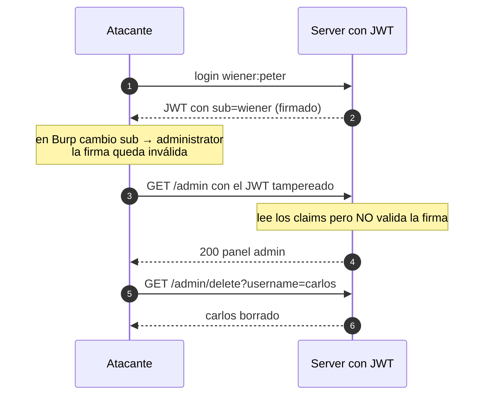

---
aliases:
  - JWT 001 - Unverified signature
  - tamper directo del claim
tags:
  - vuln/jwt
  - example
  - portswigger
---

# 001 — Unverified signature (tamper directo del claim)

> Lab: [JWT authentication bypass via unverified signature](https://portswigger.net/web-security/jwt/lab-jwt-authentication-bypass-via-unverified-signature) · Apprentice · Teoría → [[how-to-work/jwt|cómo funciona un JWT]] · [[vulnerabilities/018-jwt-attacks/jwt-attacks|entry point]]

## Qué muestra
El server **decodifica los claims pero NO verifica la firma**. Cambiás `sub` a `administrator` y entra, aunque la firma quede inválida.

## Diagrama

## Por qué funciona
- La firma existe para detectar cambios, pero el server **no la comprueba** → cualquier claim es tuyo.
- No hace falta re-firmar ni conocer ninguna clave.

## Cómo explotarlo (paso a paso)
1. Logueate como `wiener:peter`, mandá la request con el JWT a **Repeater**.
2. En la pestaña **JSON Web Token**, cambiá `"sub":"wiener"` → `"sub":"administrator"`.
3. Enviá tal cual → `/admin` → `GET /admin/delete?username=carlos`.

## Verificación
- Con el `sub` cambiado ya accedés a `/admin` (no hace falta firma válida).

## Detalles que se pasan por alto
- Es el bug más barato: **siempre probalo primero** (cambiar un claim sin re-firmar).
- Si el server SÍ verifica, pasás al 002 (`alg:none`) y al resto.
