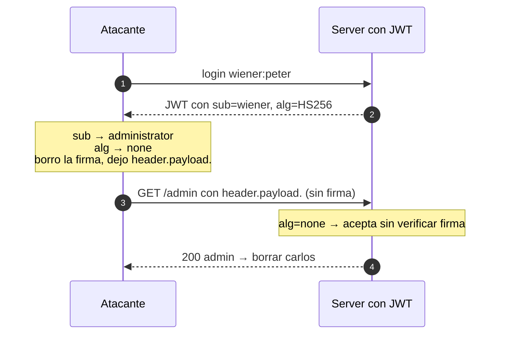

---
aliases:
  - JWT 002 - alg none
  - flawed signature verification
tags:
  - vuln/jwt
  - example
  - portswigger
---

# 002 — `alg: none` (token sin firma)

> Lab: [JWT authentication bypass via flawed signature verification](https://portswigger.net/web-security/jwt/lab-jwt-authentication-bypass-via-flawed-signature-verification) · Apprentice · Teoría → [[how-to-work/jwt|cómo funciona un JWT]] · [[vulnerabilities/018-jwt-attacks/jwt-attacks|entry point]]

## Qué muestra
El server **acepta tokens "sin firmar"** cuando `alg` es `none`. Ponés `alg:none`, editás el claim y **borrás la firma** (dejando el punto final).

## JWT (original → modificado)

**Original** (decodificado)
```json
{ "alg": "HS256", "typ": "JWT" }   // header
{ "sub": "wiener" }                // payload
```
**Modificado**
```json
{ "alg": "none", "typ": "JWT" }    // header   ← cambiado
{ "sub": "administrator" }         // payload  ← cambiado
```
> **Firma:** **eliminada** → el token queda `header.payload.` (3ª parte vacía).

## Diagrama



## Por qué funciona
- `alg:none` le dice al server "este token no tiene firma"; una implementación insegura **lo cree** y salta la verificación.
- El punto final (`header.payload.`) es obligatorio: el JWT sigue teniendo 3 partes, la 3ª vacía.

## Cómo explotarlo (paso a paso)
1. En Repeater, payload: `"sub":"administrator"`.
2. Header: `"alg":"none"`.
3. **Borrá la firma** dejando el punto final → `BASE64(header).BASE64(payload).`
   > En JWT Editor podés usar el botón de ataque **"none"** que lo hace solo.
4. Enviá → `/admin` → borrar `carlos`.

## Verificación
- El token sin firma con `sub:administrator` te deja entrar a `/admin`.

## Detalles que se pasan por alto
- Probá variantes de capitalización (`None`, `NONE`) si `none` es filtrado por una blacklist ingenua.
- Distinto del 001: acá el server **sí** intentaría verificar, pero `none` lo desactiva.
