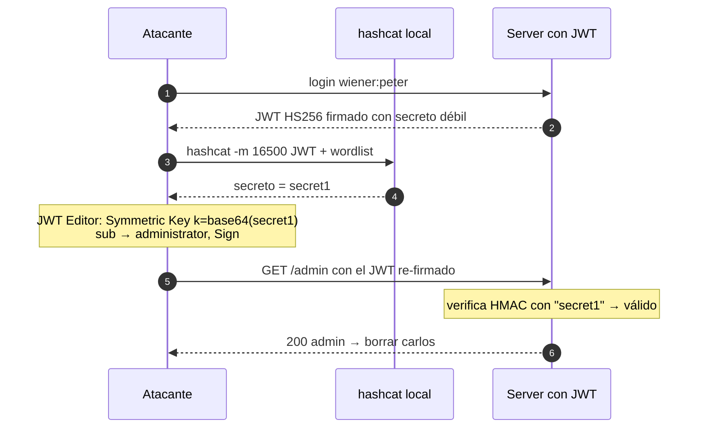

---
aliases:
  - JWT 003 - Weak signing key
  - brute force HMAC hashcat
tags:
  - vuln/jwt
  - example
  - portswigger
---

# 003 — Weak signing key (brute force del secreto HMAC)

> Lab: [JWT authentication bypass via weak signing key](https://portswigger.net/web-security/jwt/lab-jwt-authentication-bypass-via-weak-signing-key) · Practitioner · Teoría → [[how-to-work/symmetric-vs-asymmetric|simétrico vs asimétrico]] · [[vulnerabilities/018-jwt-attacks/jwt-attacks|entry point]]

## Qué muestra
El JWT usa **HS256 (simétrico)** con un **secreto débil**. Lo **crackeás** con hashcat y, como en simétrico *firmar = verificar*, firmás vos tokens válidos.

## JWT (original → modificado)

Las 3 partes decodificadas. <mark style="background:#a5d6a7;color:#111">🎯 objetivo</mark> = lo que querés · <mark style="background:#ffcc80;color:#111">⚙️ consecuencia</mark> = lo que cambia para que valide.

| Parte | Original | Modificado |
| --- | --- | --- |
| **header** | { "alg": "HS256", "kid": "…" } | { "alg": "HS256", "kid": "…" } (sin cambios) |
| **payload** | { "sub": "wiener" } | { "sub": <mark style="background:#a5d6a7;color:#111">"administrator"</mark> } |
| **signature** | HMAC con el secreto del server (desconocido) | <mark style="background:#ffcc80;color:#111">re-firmada con el secreto crackeado</mark> (`secret1`, hashcat -m 16500) |

> **🎯 Objetivo:** `sub → administrator`. **⚙️ Consecuencia (acá está el cambio real):** **re-firmar** con el secreto crackeado (`secret1`, hashcat -m 16500 / `crack_jwt.py`) para que el nuevo `sub` valide.

## Diagrama



## Por qué funciona
- En **HS256** el mismo secreto firma y verifica. Si es adivinable, el atacante **también puede firmar**.
- El crackeo es offline: no tocás el server hasta tener el secreto.

## Cómo explotarlo (paso a paso)
1. Crackeá el secreto:
   ```
   hashcat -a 0 -m 16500 <JWT> jwt.secrets.list        # → secret1
   ```
   > O el script del repo: pegá el JWT en `scripts/crack_jwt.py` y `python crack_jwt.py`.
2. **JWT Editor Keys → New Symmetric Key** → reemplazá `k` por el **Base64url de `secret1`**.
3. En Repeater: `"sub":"administrator"` → **Sign** con esa clave (HS256).
4. Enviá → `/admin` → borrar `carlos`.

## Verificación
- El token re-firmado con el secreto crackeado valida y entrás a `/admin`.

## Detalles que se pasan por alto
- `-m 16500` es el modo JWT de hashcat. El `k` de la Symmetric Key es **Base64url**.
- Solo aplica a algoritmos **simétricos** (HS*). Para RS* la salida es algorithm confusion (007/008).
