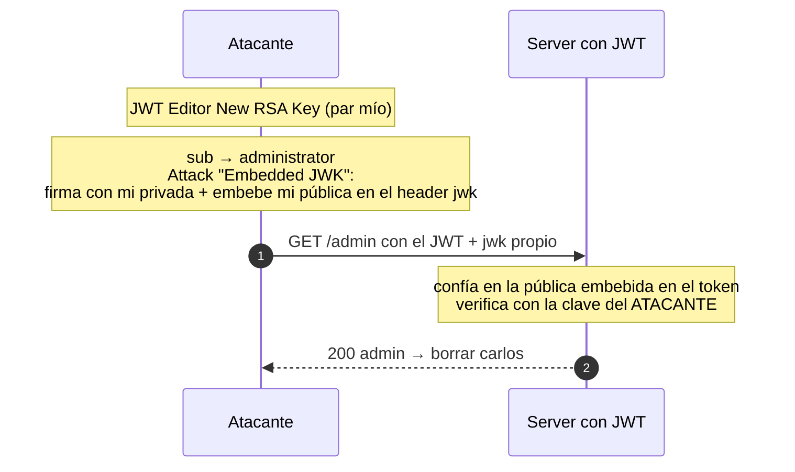

---
aliases:
  - JWT 004 - jwk injection
  - Embedded JWK
tags:
  - vuln/jwt
  - example
  - portswigger
---

# 004 — `jwk` injection (Embedded JWK, self-signed)

> Lab: [JWT authentication bypass via jwk header injection](https://portswigger.net/web-security/jwt/lab-jwt-authentication-bypass-via-jwk-header-injection) · Practitioner · Teoría → [[how-to-work/jwt#3. `kid`, `jwk`, `jku` (cómo el server elige la clave)|jwk en how-to-work]] · [[vulnerabilities/018-jwt-attacks/jwt-attacks|entry point]]

## Qué muestra
El server verifica con la **clave pública embebida en el propio token** (`jwk`). Le metés **tu** clave → firma con tu privada y el server valida con tu pública.

## JWT (original → modificado)

**Original** (decodificado)
```json
{ "kid": "…", "alg": "RS256" }                        // header
{ "sub": "wiener" }                                   // payload
```
**Modificado**
```json
{ "kid": "…", "alg": "RS256", "jwk": { …tu pública RSA… } }   // header   ← agregado
{ "sub": "administrator" }                                    // payload  ← cambiado
```
> **Firma:** **re-firmada** con tu clave privada RSA; el server valida con el `jwk` embebido.

## Diagrama



## Por qué funciona
- La implementación **le da prioridad a la clave que viene dentro del JWT** (`jwk`) en vez de usar solo su clave de confianza.
- Como sos vos quien firma con la privada correspondiente, la verificación con **tu** pública da válido.

## Cómo explotarlo (paso a paso)
1. **JWT Editor Keys → New RSA Key → Generate**.
2. En Repeater, payload: `"sub":"administrator"`.
3. Botón **Attack → "Embedded JWK"** → elegí tu clave (firma + embebe la pública en `jwk`).
4. Enviá → `/admin` → borrar `carlos`.

## Verificación
- El JWT con tu `jwk` embebido valida y accedés a `/admin`.

## Detalles que se pasan por alto
- Diferencia con `jku` (005): acá la clave va **dentro** del token; en `jku` va en una **URL** que el server descarga.
- La causa raíz: confiar en key material provisto por el cliente.
