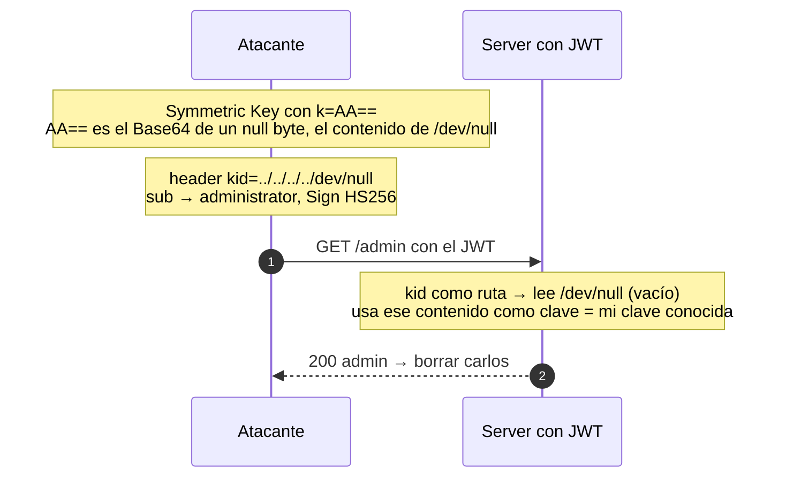

---
aliases:
  - JWT 006 - kid path traversal
  - kid dev null
tags:
  - vuln/jwt
  - example
  - portswigger
---

# 006 — `kid` path traversal (`/dev/null`)

> Lab: [JWT authentication bypass via kid header path traversal](https://portswigger.net/web-security/jwt/lab-jwt-authentication-bypass-via-kid-header-path-traversal) · Practitioner · Teoría → [[how-to-work/jwt#3. `kid`, `jwk`, `jku` (cómo el server elige la clave)|kid en how-to-work]] · [[vulnerabilities/018-jwt-attacks/jwt-attacks|entry point]]

## Qué muestra
El server usa `kid` como **ruta de archivo** para cargar la clave. Con **path traversal** apuntás a un archivo de contenido **predecible** (`/dev/null`, vacío) y firmás con esa clave "conocida".

## JWT (original → modificado)

Las 3 partes decodificadas. <mark style="background:#a5d6a7;color:#111">🎯 objetivo</mark> = lo que querés · <mark style="background:#ffcc80;color:#111">⚙️ consecuencia</mark> = lo que cambia para que valide.

| Parte | Original | Modificado |
| --- | --- | --- |
| **header** | { "kid": "<uuid del server>", "alg": "HS256" } | { "kid": <mark style="background:#ffcc80;color:#111">"../../../../../../../dev/null"</mark>, "alg": "HS256" } |
| **payload** | { "sub": "wiener" } | { "sub": <mark style="background:#a5d6a7;color:#111">"administrator"</mark> } |
| **signature** | HMAC (clave que el server carga por `kid`) | <mark style="background:#ffcc80;color:#111">HMAC con k=AA==</mark> (Base64 de un null byte = /dev/null) |

> **🎯 Objetivo:** `sub → administrator`. **⚙️ Consecuencia:** `kid → /dev/null` y firmar HS256 con `k=AA==` (clave conocida = null byte).

## Diagrama

## Por qué funciona
- El `kid` va sin sanitizar a una **lectura de archivo** → path traversal.
- `/dev/null` devuelve contenido **vacío/predecible**; vos creás una clave simétrica con ese mismo contenido → la firma coincide.

## Cómo explotarlo (paso a paso)
1. **JWT Editor Keys → New Symmetric Key → Generate** → reemplazá `k` por **`AA==`**.
2. En el header: `"kid":"../../../../../../../dev/null"`.
3. payload: `"sub":"administrator"` → **Sign** (HS256) con esa Symmetric Key.
4. Enviá → `/admin` → borrar `carlos`.

## Verificación
- El token firmado con la clave "nula" valida y entrás a `/admin`.

## Detalles que se pasan por alto
- Si `kid` fuera a una **DB**, el vector sería **SQLi** en vez de path traversal.
- La clave del truco es apuntar a un archivo cuyo contenido **vos ya conocés** (`/dev/null` = vacío).
