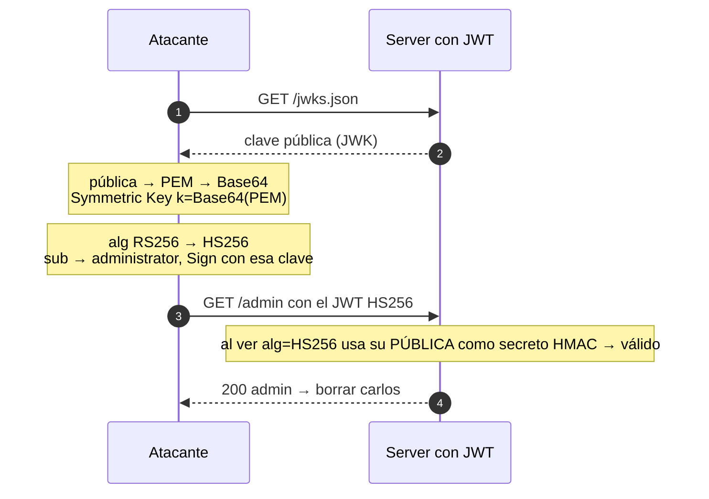

---
aliases:
  - JWT 007 - Algorithm confusion
  - RS256 to HS256
tags:
  - vuln/jwt
  - example
  - portswigger
---

# 007 — Algorithm confusion (RS256 → HS256, con clave expuesta)

> Lab: [JWT authentication bypass via algorithm confusion](https://portswigger.net/web-security/jwt/algorithm-confusion/lab-jwt-authentication-bypass-via-algorithm-confusion) · Expert · Teoría → [[how-to-work/symmetric-vs-asymmetric|simétrico vs asimétrico]] · [[vulnerabilities/018-jwt-attacks/jwt-attacks|entry point]]

## Qué muestra
El server firma con **RS256 (asimétrico)** pero **no fija el algoritmo** al verificar. Cambiás `alg` a **HS256** y firmás usando la **clave pública del server como secreto HMAC**.

## Diagrama

## Por qué funciona
- El server debería exigir el algoritmo esperado (RS256). Al aceptar HS256, **usa la clave pública como secreto**.
- La pública **es conocida** (`/jwks.json`), así que vos podés calcular el mismo HMAC → firma válida.

## Cómo explotarlo (paso a paso)
1. Bajá la pública: `GET /jwks.json` (o `/.well-known/jwks.json`).
2. **New RSA Key** en JWT Editor → pegá el JWK. Click derecho → **Copy Public Key as PEM**. **Base64**-eá ese PEM.
3. **New Symmetric Key** → `k` = Base64 del PEM.
4. En Repeater: header `"alg":"HS256"`, payload `"sub":"administrator"` → **Sign** con la Symmetric Key.
5. Enviá → `/admin` → borrar `carlos`.

## Verificación
- El JWT HS256 firmado con la pública como secreto valida → entrás a `/admin`.

## Detalles que se pasan por alto
- Hay que ser consistente con el **formato exacto** del PEM que usó el server (saltos de línea incluidos) al derivar el secreto.
- Si la pública **no** está publicada → hay que derivarla de 2 tokens (008).
