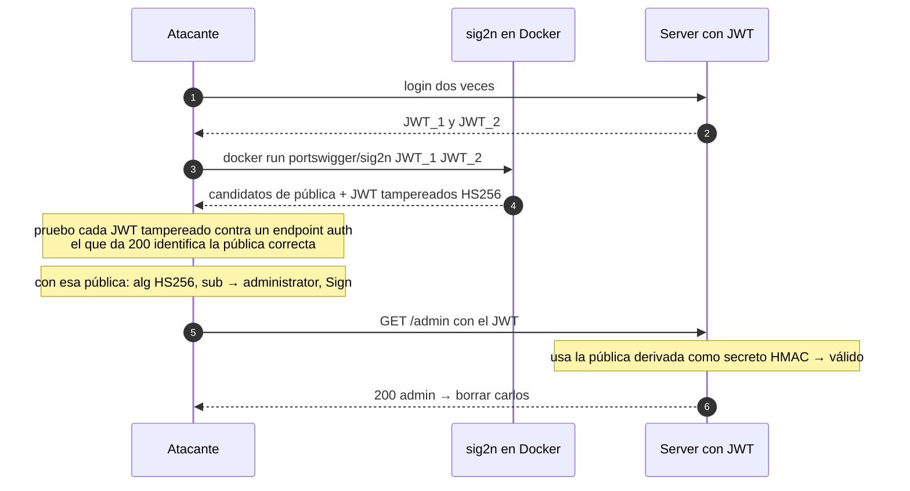

---
aliases:
  - JWT 008 - Algorithm confusion no exposed key
  - sig2n derivar publica
tags:
  - vuln/jwt
  - example
  - portswigger
---

# 008 — Algorithm confusion sin clave expuesta (derivar la pública)

> Lab: [Algorithm confusion with no exposed key](https://portswigger.net/web-security/jwt/algorithm-confusion/lab-jwt-authentication-bypass-via-algorithm-confusion-with-no-exposed-key) · Expert · Teoría → [[how-to-work/symmetric-vs-asymmetric|simétrico vs asimétrico]] · [[vulnerabilities/018-jwt-attacks/jwt-attacks|entry point]]

## Qué muestra
Igual que el 007, **pero la clave pública NO está publicada** (no hay `/jwks.json`). Se **reconstruye** matemáticamente a partir de **2 JWT** del mismo server con `sig2n`, y con esa pública se hace algorithm confusion.

## JWT (original → modificado)

Las 3 partes decodificadas. <mark style="background:#a5d6a7;color:#111">🎯 objetivo</mark> = lo que querés · <mark style="background:#ffcc80;color:#111">⚙️ consecuencia</mark> = lo que cambia para que valide.

| Parte | Original | Modificado |
| --- | --- | --- |
| **header** | { "alg": "RS256", "kid": "…" } | { "alg": <mark style="background:#ffcc80;color:#111">"HS256"</mark>, "kid": "…" } |
| **payload** | { "sub": "wiener" } | { "sub": <mark style="background:#a5d6a7;color:#111">"administrator"</mark> } |
| **signature** | RSA (clave privada del server) | <mark style="background:#ffcc80;color:#111">HMAC con la pública reconstruida (sig2n) como secreto</mark> |

> **🎯 Objetivo:** `sub → administrator`. **⚙️ Consecuencia:** `alg → HS256` y firmar con la clave pública **reconstruida** (`sig2n`) como secreto HMAC.

## Diagrama



## Por qué funciona
- Con **dos firmas RSA** del mismo par de claves se pueden derivar **candidatos** del módulo público `n` (de ahí el nombre `sig2n`).
- Una vez que tenés la pública correcta, el ataque es idéntico al 007.

## Cómo explotarlo (paso a paso)
1. Logueate **dos veces** y guardá **2 JWT** distintos.
2. Derivá candidatos:
   ```
   docker run --rm -it portswigger/sig2n <TOKEN_1> <TOKEN_2>
   ```
   Devuelve varios PEM candidatos y, por cada uno, un **JWT ya tampereado en HS256**.
3. **Probá cada JWT tampereado** contra un endpoint autenticado; el que devuelve **200** marca la clave correcta.
4. Con ese PEM: **Symmetric Key** (Base64 del PEM), `alg:HS256`, `sub:administrator` → **Sign** → `/admin` → borrar `carlos`.

## Verificación
- El JWT tampereado con la pública derivada devuelve 200 en el endpoint de prueba y luego en `/admin`.

## Detalles que se pasan por alto
- Es el mismo bug que el 007; lo único que cambia es **conseguir la pública** cuando no está expuesta.
- `sig2n` da varios candidatos: hay que **probar cuál valida**, no asumir el primero.
