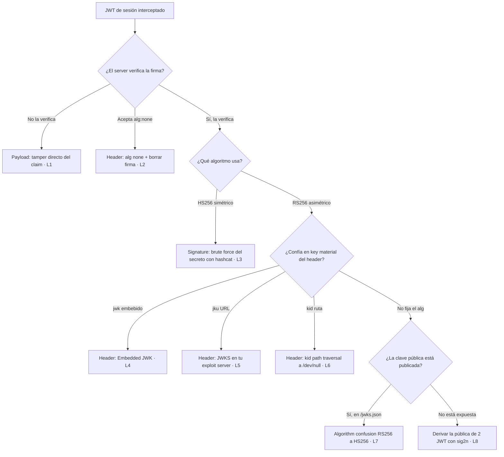

---
aliases:
  - JWT
  - jwt-attacks
  - jwk
  - jku
  - kid
tags:
  - vuln/jwt
  - entrypoint
---

# JWT attacks — Punto de entrada

> Documento **agnóstico**: *cómo **explotar** JWT*. La explotación lab por lab → [[vulnerabilities/018-jwt-attacks/labs/README|labs de JWT]].

> **Fundamentos** (formato, firma, simétrico vs asimétrico, `kid`/`jwk`/`jku`, JWS vs JWE) → [[how-to-work/jwt|Cómo funciona un JWT]].

## 🎯 Cuándo hay JWT (condiciones)

- La sesión viaja en un token de **3 partes Base64url separadas por `.`** que empieza en `eyJ...` (`eyJ` = `{"`). Decodificá header y payload.
- El **objetivo** es siempre el mismo: **modificar un claim** (típico `sub → administrator`, o `isAdmin: true`) y lograr que la **firma valide igual** — porque no se verifica, es débil, o el server confía en key material que vos controlás (`kid`/`jwk`/`jku`).
- **Herramienta central:** extensión **JWT Editor** (BApp store) — decodifica/edita en Repeater y crea/firma claves.

## 🗺️ Mapa de vulnerabilidades (árbol de decisión)

Qué probar según cómo el server verifica la firma. Cada hoja → su lab y su [[#💥 Ataques comunes (y ejemplos)|ataque]].



## 💥 Ataques comunes (y ejemplos)

Se agrupan según qué parte del JWT abusás. Cada uno tiene su **example con diagrama** → [[vulnerabilities/018-jwt-attacks/examples/001-unverified-signature|carpeta examples]].

### En el Header
- **`alg: none` + borrar la firma** — el server acepta tokens "sin firmar". Ponés `"alg":"none"`, editás el payload y dejás el token como `header.payload.` (**con el punto final**, firma vacía). → [L2].
- **`jwk` injection (self-signed JWT)** — embebés **tu** clave pública en el header `jwk`; si la implementación **le da prioridad a la clave que viene en el token**, verifica con la tuya. Firmás vos con tu privada. → [L4].
- **`jku` injection (self-signed JWT)** — apuntás `jku` a un **JWK Set en tu server**; si no valida el dominio, el server descarga tu clave y verifica con ella. → [L5].
- **`kid` injection (self-signed JWT)** — si `kid` es una **referencia a un archivo**, hacés **path traversal** a uno de contenido predecible (ej. `/dev/null` → vacío) y firmás con esa clave "conocida":
  ```json
  {
      "kid": "../../path/to/file",
      "typ": "JWT",
      "alg": "HS256",
      "k": "asGsADas3421-dfh9DGN-AFDFDbasfd8-anfjkvc"
  }
  ```
  → [L6].

### En el Payload
- **Tamper de claims** — cambiás el claim que decide privilegios: `"sub":"administrator"`, `"isAdmin": true`, `"role":"admin"`, etc. Funciona directo si el server **no verifica la firma**. → [L1].

### En la Signature
- **Bruteforce del secreto (HMAC)** — si es `HS256` con secreto débil, lo crackeás con **hashcat** (`-m 16500`) + wordlist → firmás tokens válidos. → [L3] · script `scripts/crack_jwt.py`.
- **Algorithm confusion (RS256 → HS256)** — usás la **clave pública** del server como **secreto HMAC**. Necesitás la pública (ver abajo). → [L7].
- **Derivar la clave pública de tokens existentes** — cuando la pública **no está publicada**: juntás **2 JWT** del mismo server y con **`sig2n` / `rsa_sign2n`** (Docker) reconstruís **candidatos** de la pública; probás cuál valida y con esa hacés algorithm confusion. → [L8].
- **Encontrar las claves JWT (JWKS)** — la pública suele estar expuesta en:
  ```
  /jwks.json
  /.well-known/jwks.json
  ```

> Los `[Lx]` remiten a la tabla de [[vulnerabilities/018-jwt-attacks/labs/README|labs de JWT]], donde está la solución paso a paso de cada uno.

> [!note] Seguir
> - **Fundamentos** (formato, firma, algoritmos, `kid`/`jwk`/`jku`, JWS/JWE) → [[how-to-work/jwt|Cómo funciona un JWT]].
> - **Labs** (8, con objetivo y solución paso a paso) → [[vulnerabilities/018-jwt-attacks/labs/README|labs de JWT]].
> - **Scripts** (crackear HMAC débil con hashcat) → `vulnerabilities/018-jwt-attacks/scripts/`.
> - El **`id_token`** de OpenID Connect es un JWT → [[vulnerabilities/026-oauth/oauth|oauth]].
