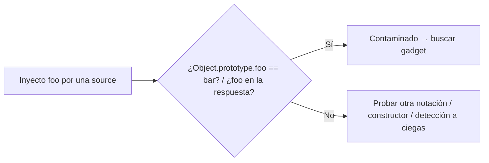

---
aliases:
  - PP 001 - sources y confirmación
  - proto sources
tags:
  - vuln/prototype-pollution
  - example
  - portswigger
---

# 001 — Sources y cómo confirmar la contaminación

> Lab: [DOM XSS via client-side prototype pollution](https://portswigger.net/web-security/prototype-pollution/client-side/lab-prototype-pollution-dom-xss-via-client-side-prototype-pollution) · Practitioner · → [[vulnerabilities/020-prototype-pollution/prototype-pollution|entry point]]

## Qué muestra
Las **tres vías** para meter una propiedad en `Object.prototype` (las *sources*) y, sobre todo, **cómo confirmar** que contaminaste antes de buscar un gadget. Confirmar primero te ahorra perseguir un sink cuando la source ni siquiera funciona.

## Las 3 sources

| Vía | Payload | Contexto |
| --- | --- | --- |
| **Query bracket** | `?__proto__[foo]=bar` | client-side (URL) |
| **Query punto** | `?__proto__.foo=bar` | client-side (cuando el bracket no anda) |
| **JSON del body** | `{"__proto__":{"foo":"bar"}}` | server-side (POST con JSON) |

> `JSON.parse('{"__proto__":{"foo":"bar"}}')` **sí** crea una clave `__proto__` propia (a diferencia de un object literal), por eso al mergearse contamina.

## Cómo confirmar

- **Client-side:** en la consola del navegador, `Object.prototype.foo` → si devuelve `"bar"`, contaminaste; si `undefined`, la source no funcionó.
- **Server-side:** si la app devuelve el objeto en JSON, `foo` **aparece reflejado** en la respuesta (un `for...in` itera también las props heredadas). Si no se refleja, no significa que sea inmune → [[vulnerabilities/020-prototype-pollution/examples/003-server-side-deteccion-a-ciegas|detección a ciegas]].

## Diagrama

## Por qué funciona
`__proto__` (o `constructor.prototype`) no se trata como clave normal en un merge recursivo: la asignación escribe en el **prototipo compartido**, así que **cualquier objeto** creado después hereda `foo`.

## Cómo explotarlo (paso a paso)
1. Elegí la source según el contexto (URL vs JSON body).
2. Inyectá una prop **basura** (`foo:bar`), nunca una real (podés romper el server).
3. Confirmá (`Object.prototype.foo` o reflexión en la respuesta).
4. Recién ahí buscá un gadget que llegue a un sink.

## Verificación
- La prop inventada aparece heredada por otro objeto → source válida.

## Detalles que se pasan por alto
- Si `__proto__` está filtrado, la source alternativa es `constructor.prototype` → [[vulnerabilities/020-prototype-pollution/examples/005-bypass-constructor-y-sanitizacion|005]].
- Una prop **no** es gadget si el objeto ya la define: la propia pisa a la heredada.

→ Siguiente: [[vulnerabilities/020-prototype-pollution/examples/002-client-side-gadget-dom-xss|002 · gadget client-side → DOM XSS]]
