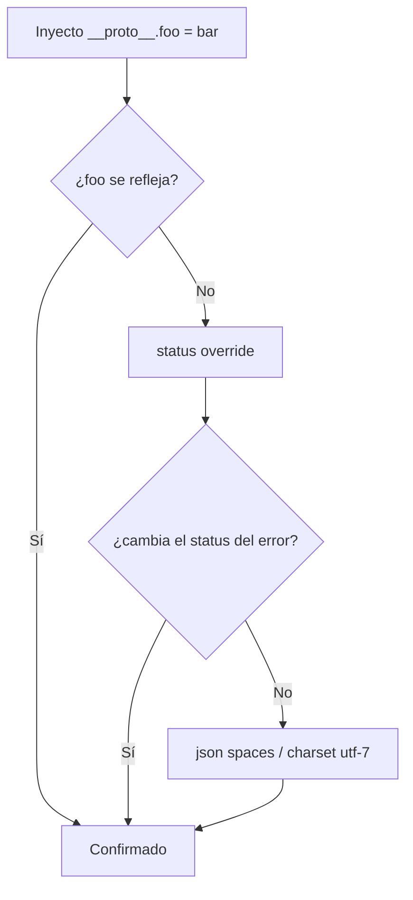

---
aliases:
  - PP 003 - detección server-side a ciegas
  - status override
  - json spaces
tags:
  - vuln/prototype-pollution
  - example
  - portswigger
---

# 003 — Detección server-side a ciegas (sin reflexión)

> Lab: [Detecting server-side prototype pollution without polluted property reflection](https://portswigger.net/web-security/prototype-pollution/server-side/lab-detecting-server-side-prototype-pollution-without-polluted-property-reflection) · Practitioner · → [[vulnerabilities/020-prototype-pollution/prototype-pollution|entry point]]

## Qué muestra
Cómo **confirmar** prototype pollution server-side cuando la prop basura **no se refleja** en la respuesta. No ves el código y no podés inspeccionar objetos, así que abusás de props que **Express/Node leen del prototipo** y producen un **cambio observable y no destructivo**.

## Las técnicas (de menos a más ruidosa)

| Técnica | Payload en el JSON del body | Qué observás |
| --- | --- | --- |
| **Reflexión** | `"__proto__":{"foo":"bar"}` | `foo` aparece en el JSON de respuesta (si no aparece → seguí abajo) |
| **Status override** | `"__proto__":{"status":400,"statusCode":400}` | forzás un error y el status pasa a 400 (rango válido 400-599) |
| **JSON spaces** | `"__proto__":{"json spaces":10}` | la **indentación** del raw de respuesta cambia (no depende de que algo se refleje) |
| **Charset utf-7** | `"__proto__":{"content-type":"application/json; charset=utf-7"}` | mandás un valor en utf-7 y vuelve decodificado |

## Detalle del charset (utf-7)
`+AGYAbwBv-` es `foo` en **utf-7**. Si contaminás el `content-type` a `charset=utf-7`, el server dropea el header real y decodifica el body como utf-7:
```json
{ "role": "+AGYAbwBv-", "__proto__": { "content-type": "application/json; charset=utf-7" } }
```
Si en la respuesta `role` vuelve como `foo`, confirmaste.

## Diagrama



## Por qué funciona
Un `for...in` y varias rutinas internas de Express/Node (`http-errors`, serializador JSON, `body-parser`) leen props (`status`, `json spaces`, `content-type`) que **normalmente no están definidas** en el objeto → toman el valor heredado del prototipo contaminado.

## Cómo explotarlo (paso a paso)
1. `"__proto__":{"foo":"bar"}` → mirá si se refleja.
2. Si no: rompé la sintaxis del JSON (borrá una coma) para forzar un error y ver el status por defecto.
3. `"__proto__":{"status":400,"statusCode":400}` → forzá el error de nuevo; si el status cambió, confirmado.
4. Alternativas si el status no sirve: `json spaces` (mirá la indentación del raw) o `charset` utf-7.

## Verificación
- Un cambio observable de status / indentación / charset con una prop que vos inyectaste = prototype pollution confirmada, **sin romper nada**.

## Detalles que se pasan por alto
- **Nunca** contamines una prop **real** de arranque: podés tirar el proceso Node (queda contaminado toda su vida).
- Confirmada la vuln, seguí con el gadget del objetivo: [[vulnerabilities/020-prototype-pollution/examples/004-server-side-escalada-isadmin|escalada]] o [[vulnerabilities/020-prototype-pollution/examples/006-server-side-rce-execargv-fork|RCE]].

→ Siguiente: [[vulnerabilities/020-prototype-pollution/examples/004-server-side-escalada-isadmin|004 · escalada de privilegios (isAdmin)]]
