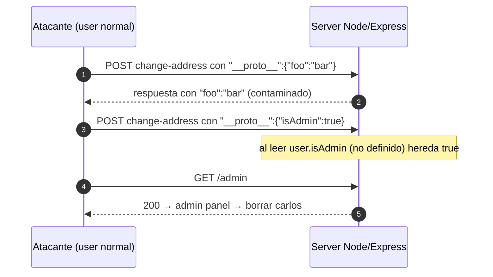

---
aliases:
  - PP 004 - escalada isAdmin
  - privilege escalation server-side
tags:
  - vuln/prototype-pollution
  - example
  - portswigger
---

# 004 — Escalada de privilegios server-side (`isAdmin`)

> Lab: [Privilege escalation via server-side prototype pollution](https://portswigger.net/web-security/prototype-pollution/server-side/lab-privilege-escalation-via-server-side-prototype-pollution) · Practitioner · → [[vulnerabilities/020-prototype-pollution/prototype-pollution|entry point]]

## Qué muestra
El gadget más simple de server-side: la app decide permisos leyendo `user.isAdmin`, una prop que **para un usuario normal no está definida**. Contaminás `Object.prototype.isAdmin = true` y **todos** los usuarios (vos incluido) pasan a admin.

## El payload

| Paso | Body (`POST /my-account/change-address`) | Efecto |
| --- | --- | --- |
| Confirmar | `{ "...datos...", "__proto__": { "foo": "bar" } }` | `foo` aparece reflejado en la respuesta |
| Escalar | `{ "...datos...", "__proto__": { "isAdmin": <mark style="background:#a5d6a7;color:#111">true</mark> } }` | tu sesión hereda `isAdmin:true` |

## Diagrama

## Por qué funciona
`isAdmin` es un **gadget**: el chequeo de autorización lee la prop sin que el objeto usuario la defina, así que toma el `true` heredado del prototipo contaminado.

## Cómo explotarlo (paso a paso)
1. En Burp Repeater, sobre el JSON de `POST /my-account/change-address`, agregá `"__proto__":{"foo":"bar"}` → verificá que `foo` se refleja.
2. Cambiá a `"__proto__":{"isAdmin":true}`.
3. Refrescá la cuenta → aparece el link al **admin panel**.
4. Entrá y **borrá al usuario `carlos`** para resolver.

## Verificación
- Aparece el admin panel para tu usuario normal.

## Detalles que se pasan por alto
- Si `foo` **no** se refleja, no está inmune → [[vulnerabilities/020-prototype-pollution/examples/003-server-side-deteccion-a-ciegas|detección a ciegas]] y después este mismo gadget.
- Si filtran la clave `__proto__`, usá `constructor.prototype` → [[vulnerabilities/020-prototype-pollution/examples/005-bypass-constructor-y-sanitizacion|005]].

→ Siguiente: [[vulnerabilities/020-prototype-pollution/examples/005-bypass-constructor-y-sanitizacion|005 · bypass de defensas]]
