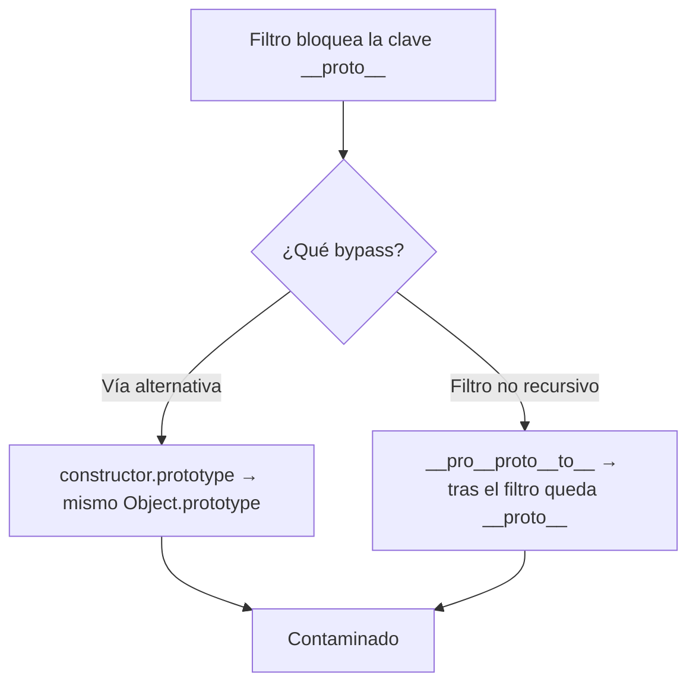

---
aliases:
  - PP 005 - bypass constructor y sanitización
  - constructor.prototype
tags:
  - vuln/prototype-pollution
  - example
  - portswigger
---

# 005 — Bypass de defensas (`constructor.prototype` + sanitización no recursiva)

> Lab: [Bypassing flawed input filters for server-side prototype pollution](https://portswigger.net/web-security/prototype-pollution/server-side/lab-bypassing-flawed-input-filters-for-server-side-prototype-pollution) · Practitioner · → [[vulnerabilities/020-prototype-pollution/prototype-pollution|entry point]]

## Qué muestra
Dos formas de saltar filtros que bloquean `__proto__`:
1. **`constructor.prototype`** — la vía alternativa que llega al **mismo** `Object.prototype`.
2. **Sanitización no recursiva** — cuando el filtro borra la subcadena `__proto__` **una sola vez**.

## Bypass 1 — `constructor.prototype`

| Paso | Payload | Efecto |
| --- | --- | --- |
| Detectar | `"constructor":{"prototype":{"json spaces":10}}` | cambia la indentación del raw (contaminado) |
| Explotar | `"constructor":{"prototype":{"isAdmin":<mark style="background:#a5d6a7;color:#111">true</mark>}}` | escalás a admin |

`obj.constructor.prototype === obj.__proto__` → contaminás el prototipo sin escribir la clave `__proto__`.

## Bypass 2 — filtro no recursivo (client-side clásico)
Si la app elimina `__proto__` **una vez**, anidás la cadena:
```
?__pro__proto__to__[transport_url]=data:,alert(1);//
```
Al borrar el `__proto__` del medio, lo que queda **vuelve a formar** `__proto__`:
```
__pro + __proto__ + to__  →  (borra __proto__)  →  __pro + to__ = __proto__
```

## Diagrama



## Por qué funciona
- `constructor` y `prototype` son props legítimas que **no** suelen estar en la blacklist; la ruta `constructor.prototype` alcanza el prototipo global igual que `__proto__`.
- Una sanitización que reemplaza sin repetir el pase deja un residuo explotable: la solución correcta es sanear **en bucle** hasta que no queden coincidencias (o mejor, whitelist).

## Cómo explotarlo (paso a paso)
1. Confirmá que `__proto__` está filtrado (el payload directo no contamina).
2. Server-side: detectá con `"constructor":{"prototype":{"json spaces":10}}` y escalá con `"constructor":{"prototype":{"isAdmin":true}}`.
3. Client-side con filtro no recursivo: usá `__pro__proto__to__[...]`.

## Verificación
- Con `__proto__` bloqueado, el payload por `constructor.prototype` **sí** cambia el comportamiento (status/indentación) o escala a admin.

## Detalles que se pasan por alto
- El bypass es de **entrada**: una vez en el prototipo, el gadget final es el mismo (`isAdmin`, `execArgv`, `shell`).
- Blacklist es un parche; la defensa real es `Object.freeze(Object.prototype)` / `Object.create(null)` / whitelist.

→ Siguiente: [[vulnerabilities/020-prototype-pollution/examples/006-server-side-rce-execargv-fork|006 · RCE vía child_process.fork()]]
