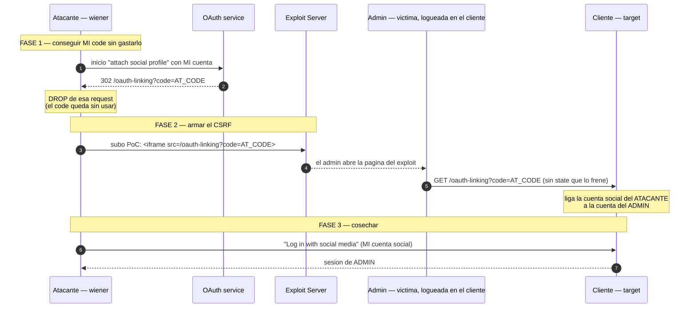

---
aliases:
  - OAuth 002 - Forced profile linking
  - CSRF sin state linking
tags:
  - vuln/oauth
  - example
  - portswigger
---

# 002 — Forced OAuth profile linking (CSRF por falta de `state`)

> Lab: [Forced OAuth profile linking](https://portswigger.net/web-security/oauth/lab-oauth-forced-oauth-profile-linking) · Practitioner · Teoría → [[vulnerabilities/026-oauth/oauth#A.2 — Protección CSRF deficiente (falta de state)|entry point A.2]] · [[vulnerabilities/003-csrf/csrf|CSRF]] · [[vulnerabilities/026-oauth/labs/README|labs]]

## Qué muestra
El endpoint que **vincula** una cuenta social a la cuenta del target (`/oauth-linking?code=...`) **no lleva `state`** → es **CSRF-eable**. El atacante obtiene un `code` válido de **su** cuenta social y, con un PoC, hace que el **navegador del admin** dispare el linking → **la cuenta social del atacante queda atada a la cuenta del admin**. Después el atacante entra con su social y **es admin**.

## Diagrama



## Por qué funciona
- El `state` sirve para probar que **el mismo usuario** que inició el flujo es el que completa el `/callback`/linking. **Sin `state`**, el cliente acepta un linking iniciado por cualquiera → CSRF clásico.
- El `code` que se liga es el del **atacante**, así que al final **su** identidad social apunta a la cuenta de la víctima.
- Hay que **dropear** el `GET /oauth-linking` propio en la fase 1: el `code` es de un solo uso; si lo dejás completar, se gasta y el PoC no sirve.

## Cómo explotarlo (paso a paso)
1. Logueado como `wiener`, andá a **"Attach a social profile"** e interceptá el flujo.
2. Cuando aparezca `GET /oauth-linking?code=...`, **dropealo** y copiá el `code`.
3. En el **exploit server** subí:
   ```html
   <iframe src="https://LAB-ID.web-security-academy.net/oauth-linking?code=AT_CODE"></iframe>
   ```
4. **Deliver to victim** (el admin lo abre) → su cuenta queda ligada a tu social.
5. **Log in with social media** con tu cuenta → entrás como admin → `/admin` → borrar a `carlos`.

## Verificación
- Tras el paso 4, hacé login con tu cuenta social: caés en la cuenta del **admin**.

## Detalles que se pasan por alto
- El bug es de **cliente** (falta de `state` en el linking). El OAuth service puede estar bien.
- Diferencia con el 003: acá **no robás** el code de la víctima; usás **tu** code y **forzás a la víctima** a lincharlo a su cuenta.
- Un `state` bien hecho es **impredecible y atado a la sesión** (no un valor fijo/reusable).
