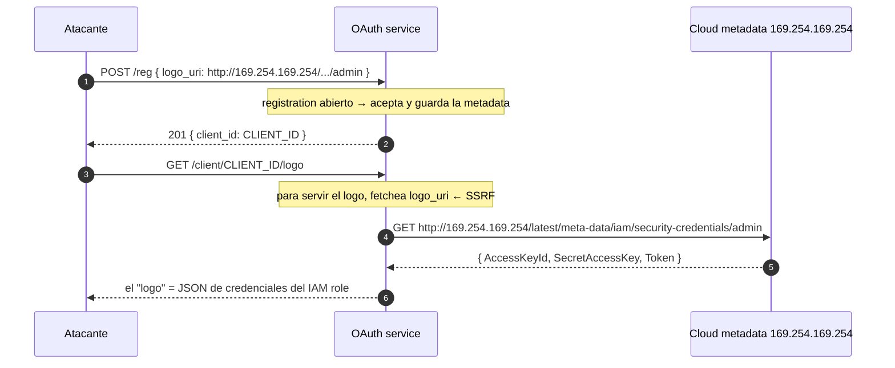

---
aliases:
  - OAuth 006 - SSRF dynamic client registration
  - logo_uri SSRF metadata
tags:
  - vuln/oauth
  - example
  - portswigger
---

# 006 — SSRF por OpenID dynamic client registration (`logo_uri`)

> Lab: [SSRF via OpenID dynamic client registration](https://portswigger.net/web-security/oauth/openid/lab-oauth-ssrf-via-openid-dynamic-client-registration) · Practitioner · Teoría → [[vulnerabilities/026-oauth/oauth#C.2 — SSRF por metadata del cliente|entry point C.2]] · [[vulnerabilities/007-ssrf/ssrf|SSRF]] · [[vulnerabilities/026-oauth/labs/README|labs]]

## Qué muestra
El OAuth service permite **registrar clientes al vuelo** (`POST /reg`, RFC 7591) **sin auth** y deja que controles metadata como **`logo_uri`**. Cuando el server intenta **renderizar el logo**, hace un `GET` a esa URL → **SSRF**. Apuntás `logo_uri` a la **metadata del cloud** (`169.254.169.254`) y leés las credenciales del IAM role. Ataque de **un solo actor** (sin víctima ni exploit server).

## Diagrama



## Por qué funciona
- El `registration_endpoint` **abierto** deja que un anónimo defina campos de cliente que son **URLs que el server fetchea** (`logo_uri`, `jwks_uri`, `sector_identifier_uri`, `request_uri`).
- Al pedir el logo, el server hace la petición **desde su propia red** → alcanza `169.254.169.254`, un host que el atacante no puede tocar directo.
- La respuesta del fetch se **devuelve/refleja** al pedir el logo → SSRF **no ciego**: leés las credenciales directo.

## Cómo explotarlo (paso a paso)
1. Confirmá en `/.well-known/openid-configuration` que hay `registration_endpoint`.
2. Registrá un cliente con el `logo_uri` malicioso:
   ```
   POST /reg HTTP/1.1
   Host: OAUTH-ID.oauth-server.net
   Content-Type: application/json

   {"redirect_uris":["https://LAB-ID.web-security-academy.net/oauth-callback"],
    "logo_uri":"http://169.254.169.254/latest/meta-data/iam/security-credentials/admin"}
   ```
3. Guardá el `client_id` de la respuesta.
4. Disparás el fetch del logo:
   ```
   GET /client/CLIENT_ID/logo HTTP/1.1
   Host: OAUTH-ID.oauth-server.net
   ```
5. La respuesta trae el JSON de credenciales → esa es la solución.

## Verificación
- El `GET .../logo` devuelve `AccessKeyId` / `SecretAccessKey` en vez de una imagen.

## Detalles que se pasan por alto
- Otros vectores del mismo bug: **`request_uri`** (si `request_uri_parameter_supported: true`, el server descarga el request object desde tu URL — SSRF **sin registrar**), `jwks_uri`, `sector_identifier_uri`.
- Ruta de metadata AWS: `/latest/meta-data/iam/security-credentials/<rol>` (primero listás el rol pidiendo `.../security-credentials/`).
- Es un **SSRF** puro montado sobre OAuth → mismo repertorio de bypass y targets internos que [[vulnerabilities/007-ssrf/ssrf|SSRF]].
